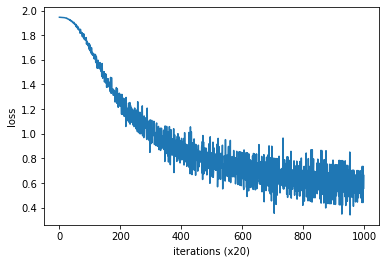

## Word2Vec

### 推論ベースの手法とニューラルネットワーク

#### カウントベースの手法の問題点
- 現実で扱うコーパスの語彙数は非常に巨大→語彙数×語彙数のサイズの行列を作成しないといけないため、計算上困難
- 対して、推論ベースの手法ではミニバッチ学習を行うことが可能。
- NNでは、GPUによる並列計算も可能であり、計算速度において推論ベースに分がある。

#### 推論ベースの手法の概要
- 分布仮説がベース
- コンテキストを入力として与え、モデルは各単語の出現確立を出力する
- word2vecではモデルにNNを使う

#### ニューラルネットワークにおける単語の処理方法
- 入力データ(1つ1つの単語)は、one-hot表現に変換する


```python
import numpy as np
c = np.array([[1,0,0,0,0,0,0]]) #入力
W = np.random.randn(7,3) #重み
h = np.dot(c, W) #中間ノード
print(h)
```

    [[2.06799388 0.01761088 1.49330161]]
    

- 中間ノードで行っていることは、実質該当する場所の重みを抜き出すことに相当


```python
from common.layers import MatMul
```


```python
c = np.array([[1,0,0,0,0,0,0]]) 
W = np.random.randn(7,3) 
layer = MatMul(W)
h = layer.forward(c)
print(h)
```

- こちらmatmulレイヤを使用するやり方

### シンプルなword2vec

#### CBOWモデルの推論処理


```python
#サンプルのコンテキストデータ
c0 = np.array([[1,0,0,0,0,0,0]]) 
c1 = np.array([[0,0,1,0,0,0,0]]) 

#重みの初期化
W_in = np.random.randn(7,3)
W_out = np.random.randn(3,7)

#レイヤの作成
in_layer0 = MatMul(W_in)
in_layer1 = MatMul(W_in)
out_layer = MatMul(W_out)

#順伝播
h0 = in_layer0.forward(c0)
h1 = in_layer1.forward(c1)
h = 0.5 * (h0 + h1)
s = out_layer.forward(h)

print(s)
```

#### CBOWモデルの学習
- 多クラス分類を行うニューラルネットワークなので、Softmaxと交差エントロピー誤差を用いる


#### word2vecの重みと分散表現
W_in, W_outの２つの重みが取得できる。単語の分散表現としてはどちらを使用すべきか？
- 入力側の重みだけを利用する
- 出力側の重みだけを利用する
- 2つの重みの両方を利用する

⇓

- word2vec(特にskip-gram)においては、入力側だけ利用が最もポピュラー
- GloVeでは、重みの多幸せを利用するとよい結果が得られる

### 学習データの準備

①corpus, word_to_id, id_to_wordを作成する

②contextsとtargetを作成する
- target : 対象単語のインデックスリスト
- contexts : targetの前後の単語のインデックスリスト(前後いくつとるかはwindow_sizeで指定)

③context, targetをone-hot表現化

#### コンテキストとターゲット


```python
from common.util import preprocess

text = "You say goodbye and I say hello."
corpus, word_to_id, id_to_word = preprocess(text)

print(corpus)

print(id_to_word)
```


```python
def create_contexts_target(corpus, window_size=1):
    target = corpus[window_size : -window_size]
    contexts = []
    
    for idx in range(window_size, len(corpus)-window_size):
        cs = []
        for t in range(-window_size, window_size+1):
            if t == 0:
                continue
            cs.append(corpus[idx + t])
        contexts.append(cs)
    
    return np.array(contexts), np.array(target)
```


```python
contexts, target = create_contexts_target(corpus, window_size=1)
print(contexts)
print(target)
```

- one-hot表現化は、用意されている関数を使う


```python
from common.util import convert_one_hot

vocab_size = len(word_to_id)
target = convert_one_hot(target, vocab_size)
contexts = convert_one_hot(contexts, vocab_size)
```


```python
print(contexts)
print(target)
```

### CBOWモデルの実装


```python
from common.layers import MatMul, SoftmaxWithLoss
```


```python
class SimpleCBOW:
    def __init__(self, vocab_size, hidden_size):
        V, H = vocab_size, hidden_size
        
        #重みの初期化
        W_in = 0.01 * np.random.randn(V, H).astype("f")
        W_out = 0.01 * np.random.randn(H, V).astype("f")
        
        #レイヤの作成
        self.in_layer0 = MatMul(W_in)
        self.in_layer1 = MatMul(W_in)
        self.out_layer = MatMul(W_out)
        self.loss_layer = SoftmaxWithLoss()
        
        #すべての重みと勾配をリストにまとめる
        layers = [self.in_layer0, self.in_layer1, self.out_layer]
        self.params, self.grads = [], []
        for layer in layers:
            self.params += layer.params
            self.grads += layer.grads
        
        #メンバ変数に単語の分散表現を設定
        self.word_vecs = W_in
    
    def forward(self, contexts, target):
        h0 = self.in_layer0.forward(contexts[:, 0])
        h1 = self.in_layer1.forward(contexts[:, 1])
        h = (h0 + h1) * 0.5
        score = self.out_layer.forward(h)
        loss = self.loss_layer.forward(score, target)
        return loss
    
    def backward(self, dout=1):
        ds = self.loss_layer.backward(dout)
        da = self.out_layer.backward(ds)
        da *= 0.5
        self.in_layer1.backward(da)
        self.in_layer0.backward(da)
        return None
```

#### 学習コードの実装


```python
from common.trainer import Trainer
from common.optimizer import Adam
from common.util import preprocess, create_contexts_target, convert_one_hot

window_size = 1
hidden_size = 5
batch_size = 3
max_epoch = 1000

text = "You say goodbye and I say hello."

corpus, word_to_id, id_to_word = preprocess(text)

vocab_size = len(word_to_id)
contexts, target = create_contexts_target(corpus, window_size)

target = convert_one_hot(target, vocab_size)
contexts = convert_one_hot(contexts, vocab_size)

model = SimpleCBOW(vocab_size, hidden_size)
optimizer = Adam()
trainer = Trainer(model, optimizer)

trainer.fit(contexts, target, max_epoch, batch_size)
trainer.plot()
```

    | epoch 1 |  iter 1 / 2 | time 0[s] | loss 1.95
    | epoch 2 |  iter 1 / 2 | time 0[s] | loss 1.95
    | epoch 3 |  iter 1 / 2 | time 0[s] | loss 1.95
    | epoch 4 |  iter 1 / 2 | time 0[s] | loss 1.95
    | epoch 5 |  iter 1 / 2 | time 0[s] | loss 1.95
    | epoch 6 |  iter 1 / 2 | time 0[s] | loss 1.95
    | epoch 7 |  iter 1 / 2 | time 0[s] | loss 1.95
    | epoch 8 |  iter 1 / 2 | time 0[s] | loss 1.95
    | epoch 9 |  iter 1 / 2 | time 0[s] | loss 1.95
    | epoch 10 |  iter 1 / 2 | time 0[s] | loss 1.94
    | epoch 11 |  iter 1 / 2 | time 0[s] | loss 1.95
    | epoch 12 |  iter 1 / 2 | time 0[s] | loss 1.94
    | epoch 13 |  iter 1 / 2 | time 0[s] | loss 1.94
    | epoch 14 |  iter 1 / 2 | time 0[s] | loss 1.94
    | epoch 15 |  iter 1 / 2 | time 0[s] | loss 1.94
    | epoch 16 |  iter 1 / 2 | time 0[s] | loss 1.94
    | epoch 17 |  iter 1 / 2 | time 0[s] | loss 1.94
    | epoch 18 |  iter 1 / 2 | time 0[s] | loss 1.94
    | epoch 19 |  iter 1 / 2 | time 0[s] | loss 1.94
    | epoch 20 |  iter 1 / 2 | time 0[s] | loss 1.94
    | epoch 21 |  iter 1 / 2 | time 0[s] | loss 1.94
    | epoch 22 |  iter 1 / 2 | time 0[s] | loss 1.94
    | epoch 23 |  iter 1 / 2 | time 0[s] | loss 1.94
    | epoch 24 |  iter 1 / 2 | time 0[s] | loss 1.94
    | epoch 25 |  iter 1 / 2 | time 0[s] | loss 1.94
    | epoch 26 |  iter 1 / 2 | time 0[s] | loss 1.94
    | epoch 27 |  iter 1 / 2 | time 0[s] | loss 1.93
    | epoch 28 |  iter 1 / 2 | time 0[s] | loss 1.93
    | epoch 29 |  iter 1 / 2 | time 0[s] | loss 1.93
    | epoch 30 |  iter 1 / 2 | time 0[s] | loss 1.93
    | epoch 31 |  iter 1 / 2 | time 0[s] | loss 1.93
    | epoch 32 |  iter 1 / 2 | time 0[s] | loss 1.93
    | epoch 33 |  iter 1 / 2 | time 0[s] | loss 1.93
    | epoch 34 |  iter 1 / 2 | time 0[s] | loss 1.92
    | epoch 35 |  iter 1 / 2 | time 0[s] | loss 1.93
    | epoch 36 |  iter 1 / 2 | time 0[s] | loss 1.92
    | epoch 37 |  iter 1 / 2 | time 0[s] | loss 1.92
    | epoch 38 |  iter 1 / 2 | time 0[s] | loss 1.92
    | epoch 39 |  iter 1 / 2 | time 0[s] | loss 1.92
    | epoch 40 |  iter 1 / 2 | time 0[s] | loss 1.92
    | epoch 41 |  iter 1 / 2 | time 0[s] | loss 1.91
    | epoch 42 |  iter 1 / 2 | time 0[s] | loss 1.91
    | epoch 43 |  iter 1 / 2 | time 0[s] | loss 1.91
    | epoch 44 |  iter 1 / 2 | time 0[s] | loss 1.90
    | epoch 45 |  iter 1 / 2 | time 0[s] | loss 1.90
    | epoch 46 |  iter 1 / 2 | time 0[s] | loss 1.90
    | epoch 47 |  iter 1 / 2 | time 0[s] | loss 1.90
    | epoch 48 |  iter 1 / 2 | time 0[s] | loss 1.91
    | epoch 49 |  iter 1 / 2 | time 0[s] | loss 1.90
    | epoch 50 |  iter 1 / 2 | time 0[s] | loss 1.90
    | epoch 51 |  iter 1 / 2 | time 0[s] | loss 1.89
    | epoch 52 |  iter 1 / 2 | time 0[s] | loss 1.89
    | epoch 53 |  iter 1 / 2 | time 0[s] | loss 1.89
    | epoch 54 |  iter 1 / 2 | time 0[s] | loss 1.88
    | epoch 55 |  iter 1 / 2 | time 0[s] | loss 1.87
    | epoch 56 |  iter 1 / 2 | time 0[s] | loss 1.89
    | epoch 57 |  iter 1 / 2 | time 0[s] | loss 1.87
    | epoch 58 |  iter 1 / 2 | time 0[s] | loss 1.87
    | epoch 59 |  iter 1 / 2 | time 0[s] | loss 1.86
    | epoch 60 |  iter 1 / 2 | time 0[s] | loss 1.87
    | epoch 61 |  iter 1 / 2 | time 0[s] | loss 1.86
    | epoch 62 |  iter 1 / 2 | time 0[s] | loss 1.85
    | epoch 63 |  iter 1 / 2 | time 0[s] | loss 1.86
    | epoch 64 |  iter 1 / 2 | time 0[s] | loss 1.84
    | epoch 65 |  iter 1 / 2 | time 0[s] | loss 1.85
    | epoch 66 |  iter 1 / 2 | time 0[s] | loss 1.84
    | epoch 67 |  iter 1 / 2 | time 0[s] | loss 1.85
    | epoch 68 |  iter 1 / 2 | time 0[s] | loss 1.85
    | epoch 69 |  iter 1 / 2 | time 0[s] | loss 1.82
    | epoch 70 |  iter 1 / 2 | time 0[s] | loss 1.85
    | epoch 71 |  iter 1 / 2 | time 0[s] | loss 1.83
    | epoch 72 |  iter 1 / 2 | time 0[s] | loss 1.82
    | epoch 73 |  iter 1 / 2 | time 0[s] | loss 1.82
    | epoch 74 |  iter 1 / 2 | time 0[s] | loss 1.81
    | epoch 75 |  iter 1 / 2 | time 0[s] | loss 1.82
    | epoch 76 |  iter 1 / 2 | time 0[s] | loss 1.79
    | epoch 77 |  iter 1 / 2 | time 0[s] | loss 1.80
    | epoch 78 |  iter 1 / 2 | time 0[s] | loss 1.81
    | epoch 79 |  iter 1 / 2 | time 0[s] | loss 1.80
    | epoch 80 |  iter 1 / 2 | time 0[s] | loss 1.78
    | epoch 81 |  iter 1 / 2 | time 0[s] | loss 1.81
    | epoch 82 |  iter 1 / 2 | time 0[s] | loss 1.77
    | epoch 83 |  iter 1 / 2 | time 0[s] | loss 1.77
    | epoch 84 |  iter 1 / 2 | time 0[s] | loss 1.78
    | epoch 85 |  iter 1 / 2 | time 0[s] | loss 1.76
    | epoch 86 |  iter 1 / 2 | time 0[s] | loss 1.77
    | epoch 87 |  iter 1 / 2 | time 0[s] | loss 1.77
    | epoch 88 |  iter 1 / 2 | time 0[s] | loss 1.76
    | epoch 89 |  iter 1 / 2 | time 0[s] | loss 1.78
    | epoch 90 |  iter 1 / 2 | time 0[s] | loss 1.73
    | epoch 91 |  iter 1 / 2 | time 0[s] | loss 1.75
    | epoch 92 |  iter 1 / 2 | time 0[s] | loss 1.74
    | epoch 93 |  iter 1 / 2 | time 0[s] | loss 1.73
    | epoch 94 |  iter 1 / 2 | time 0[s] | loss 1.72
    | epoch 95 |  iter 1 / 2 | time 0[s] | loss 1.73
    | epoch 96 |  iter 1 / 2 | time 0[s] | loss 1.72
    | epoch 97 |  iter 1 / 2 | time 0[s] | loss 1.74
    | epoch 98 |  iter 1 / 2 | time 0[s] | loss 1.72
    | epoch 99 |  iter 1 / 2 | time 0[s] | loss 1.68
    | epoch 100 |  iter 1 / 2 | time 0[s] | loss 1.73
    | epoch 101 |  iter 1 / 2 | time 0[s] | loss 1.67
    | epoch 102 |  iter 1 / 2 | time 0[s] | loss 1.71
    | epoch 103 |  iter 1 / 2 | time 0[s] | loss 1.68
    | epoch 104 |  iter 1 / 2 | time 0[s] | loss 1.69
    | epoch 105 |  iter 1 / 2 | time 0[s] | loss 1.65
    | epoch 106 |  iter 1 / 2 | time 0[s] | loss 1.70
    | epoch 107 |  iter 1 / 2 | time 0[s] | loss 1.69
    | epoch 108 |  iter 1 / 2 | time 0[s] | loss 1.65
    | epoch 109 |  iter 1 / 2 | time 0[s] | loss 1.66
    | epoch 110 |  iter 1 / 2 | time 0[s] | loss 1.64
    | epoch 111 |  iter 1 / 2 | time 0[s] | loss 1.65
    | epoch 112 |  iter 1 / 2 | time 0[s] | loss 1.65
    | epoch 113 |  iter 1 / 2 | time 0[s] | loss 1.64
    | epoch 114 |  iter 1 / 2 | time 0[s] | loss 1.65
    | epoch 115 |  iter 1 / 2 | time 0[s] | loss 1.61
    | epoch 116 |  iter 1 / 2 | time 0[s] | loss 1.63
    | epoch 117 |  iter 1 / 2 | time 0[s] | loss 1.62
    | epoch 118 |  iter 1 / 2 | time 0[s] | loss 1.61
    | epoch 119 |  iter 1 / 2 | time 0[s] | loss 1.64
    | epoch 120 |  iter 1 / 2 | time 0[s] | loss 1.58
    | epoch 121 |  iter 1 / 2 | time 0[s] | loss 1.58
    | epoch 122 |  iter 1 / 2 | time 0[s] | loss 1.63
    | epoch 123 |  iter 1 / 2 | time 0[s] | loss 1.61
    | epoch 124 |  iter 1 / 2 | time 0[s] | loss 1.59
    | epoch 125 |  iter 1 / 2 | time 0[s] | loss 1.53
    | epoch 126 |  iter 1 / 2 | time 0[s] | loss 1.59
    | epoch 127 |  iter 1 / 2 | time 0[s] | loss 1.58
    | epoch 128 |  iter 1 / 2 | time 0[s] | loss 1.60
    | epoch 129 |  iter 1 / 2 | time 0[s] | loss 1.53
    | epoch 130 |  iter 1 / 2 | time 0[s] | loss 1.55
    | epoch 131 |  iter 1 / 2 | time 0[s] | loss 1.57
    | epoch 132 |  iter 1 / 2 | time 0[s] | loss 1.54
    | epoch 133 |  iter 1 / 2 | time 0[s] | loss 1.55
    | epoch 134 |  iter 1 / 2 | time 0[s] | loss 1.58
    | epoch 135 |  iter 1 / 2 | time 0[s] | loss 1.52
    | epoch 136 |  iter 1 / 2 | time 0[s] | loss 1.53
    | epoch 137 |  iter 1 / 2 | time 0[s] | loss 1.51
    | epoch 138 |  iter 1 / 2 | time 0[s] | loss 1.51
    | epoch 139 |  iter 1 / 2 | time 0[s] | loss 1.53
    | epoch 140 |  iter 1 / 2 | time 0[s] | loss 1.47
    | epoch 141 |  iter 1 / 2 | time 0[s] | loss 1.57
    | epoch 142 |  iter 1 / 2 | time 0[s] | loss 1.51
    | epoch 143 |  iter 1 / 2 | time 0[s] | loss 1.45
    | epoch 144 |  iter 1 / 2 | time 0[s] | loss 1.50
    | epoch 145 |  iter 1 / 2 | time 0[s] | loss 1.48
    | epoch 146 |  iter 1 / 2 | time 0[s] | loss 1.48
    | epoch 147 |  iter 1 / 2 | time 0[s] | loss 1.48
    | epoch 148 |  iter 1 / 2 | time 0[s] | loss 1.50
    | epoch 149 |  iter 1 / 2 | time 0[s] | loss 1.42
    | epoch 150 |  iter 1 / 2 | time 0[s] | loss 1.48
    | epoch 151 |  iter 1 / 2 | time 0[s] | loss 1.46
    | epoch 152 |  iter 1 / 2 | time 0[s] | loss 1.49
    | epoch 153 |  iter 1 / 2 | time 0[s] | loss 1.41
    | epoch 154 |  iter 1 / 2 | time 0[s] | loss 1.48
    | epoch 155 |  iter 1 / 2 | time 0[s] | loss 1.46
    | epoch 156 |  iter 1 / 2 | time 0[s] | loss 1.38
    | epoch 157 |  iter 1 / 2 | time 0[s] | loss 1.44
    | epoch 158 |  iter 1 / 2 | time 0[s] | loss 1.45
    | epoch 159 |  iter 1 / 2 | time 0[s] | loss 1.45
    | epoch 160 |  iter 1 / 2 | time 0[s] | loss 1.38
    | epoch 161 |  iter 1 / 2 | time 0[s] | loss 1.45
    | epoch 162 |  iter 1 / 2 | time 0[s] | loss 1.40
    | epoch 163 |  iter 1 / 2 | time 0[s] | loss 1.40
    | epoch 164 |  iter 1 / 2 | time 0[s] | loss 1.39
    | epoch 165 |  iter 1 / 2 | time 0[s] | loss 1.39
    | epoch 166 |  iter 1 / 2 | time 0[s] | loss 1.42
    | epoch 167 |  iter 1 / 2 | time 0[s] | loss 1.38
    | epoch 168 |  iter 1 / 2 | time 0[s] | loss 1.34
    | epoch 169 |  iter 1 / 2 | time 0[s] | loss 1.46
    | epoch 170 |  iter 1 / 2 | time 0[s] | loss 1.36
    | epoch 171 |  iter 1 / 2 | time 0[s] | loss 1.33
    | epoch 172 |  iter 1 / 2 | time 0[s] | loss 1.46
    | epoch 173 |  iter 1 / 2 | time 0[s] | loss 1.36
    | epoch 174 |  iter 1 / 2 | time 0[s] | loss 1.33
    | epoch 175 |  iter 1 / 2 | time 0[s] | loss 1.36
    | epoch 176 |  iter 1 / 2 | time 0[s] | loss 1.34
    | epoch 177 |  iter 1 / 2 | time 0[s] | loss 1.36
    | epoch 178 |  iter 1 / 2 | time 0[s] | loss 1.31
    | epoch 179 |  iter 1 / 2 | time 0[s] | loss 1.34
    | epoch 180 |  iter 1 / 2 | time 0[s] | loss 1.35
    | epoch 181 |  iter 1 / 2 | time 0[s] | loss 1.35
    | epoch 182 |  iter 1 / 2 | time 0[s] | loss 1.35
    | epoch 183 |  iter 1 / 2 | time 0[s] | loss 1.31
    | epoch 184 |  iter 1 / 2 | time 0[s] | loss 1.26
    | epoch 185 |  iter 1 / 2 | time 0[s] | loss 1.33
    | epoch 186 |  iter 1 / 2 | time 0[s] | loss 1.30
    | epoch 187 |  iter 1 / 2 | time 0[s] | loss 1.31
    | epoch 188 |  iter 1 / 2 | time 0[s] | loss 1.37
    | epoch 189 |  iter 1 / 2 | time 0[s] | loss 1.28
    | epoch 190 |  iter 1 / 2 | time 0[s] | loss 1.25
    | epoch 191 |  iter 1 / 2 | time 0[s] | loss 1.36
    | epoch 192 |  iter 1 / 2 | time 0[s] | loss 1.32
    | epoch 193 |  iter 1 / 2 | time 0[s] | loss 1.26
    | epoch 194 |  iter 1 / 2 | time 0[s] | loss 1.21
    | epoch 195 |  iter 1 / 2 | time 0[s] | loss 1.32
    | epoch 196 |  iter 1 / 2 | time 0[s] | loss 1.29
    | epoch 197 |  iter 1 / 2 | time 0[s] | loss 1.23
    | epoch 198 |  iter 1 / 2 | time 0[s] | loss 1.33
    | epoch 199 |  iter 1 / 2 | time 0[s] | loss 1.31
    | epoch 200 |  iter 1 / 2 | time 0[s] | loss 1.22
    | epoch 201 |  iter 1 / 2 | time 0[s] | loss 1.26
    | epoch 202 |  iter 1 / 2 | time 0[s] | loss 1.32
    | epoch 203 |  iter 1 / 2 | time 0[s] | loss 1.22
    | epoch 204 |  iter 1 / 2 | time 0[s] | loss 1.22
    | epoch 205 |  iter 1 / 2 | time 0[s] | loss 1.16
    | epoch 206 |  iter 1 / 2 | time 0[s] | loss 1.32
    | epoch 207 |  iter 1 / 2 | time 0[s] | loss 1.29
    | epoch 208 |  iter 1 / 2 | time 0[s] | loss 1.19
    | epoch 209 |  iter 1 / 2 | time 0[s] | loss 1.23
    | epoch 210 |  iter 1 / 2 | time 0[s] | loss 1.16
    | epoch 211 |  iter 1 / 2 | time 0[s] | loss 1.29
    | epoch 212 |  iter 1 / 2 | time 0[s] | loss 1.26
    | epoch 213 |  iter 1 / 2 | time 0[s] | loss 1.22
    | epoch 214 |  iter 1 / 2 | time 0[s] | loss 1.14
    | epoch 215 |  iter 1 / 2 | time 0[s] | loss 1.28
    | epoch 216 |  iter 1 / 2 | time 0[s] | loss 1.15
    | epoch 217 |  iter 1 / 2 | time 0[s] | loss 1.26
    | epoch 218 |  iter 1 / 2 | time 0[s] | loss 1.29
    | epoch 219 |  iter 1 / 2 | time 0[s] | loss 1.06
    | epoch 220 |  iter 1 / 2 | time 0[s] | loss 1.29
    | epoch 221 |  iter 1 / 2 | time 0[s] | loss 1.17
    | epoch 222 |  iter 1 / 2 | time 0[s] | loss 1.19
    | epoch 223 |  iter 1 / 2 | time 0[s] | loss 1.21
    | epoch 224 |  iter 1 / 2 | time 0[s] | loss 1.21
    | epoch 225 |  iter 1 / 2 | time 0[s] | loss 1.18
    | epoch 226 |  iter 1 / 2 | time 0[s] | loss 1.10
    | epoch 227 |  iter 1 / 2 | time 0[s] | loss 1.18
    | epoch 228 |  iter 1 / 2 | time 0[s] | loss 1.25
    | epoch 229 |  iter 1 / 2 | time 0[s] | loss 1.24
    | epoch 230 |  iter 1 / 2 | time 0[s] | loss 1.09
    | epoch 231 |  iter 1 / 2 | time 0[s] | loss 1.17
    | epoch 232 |  iter 1 / 2 | time 0[s] | loss 1.25
    | epoch 233 |  iter 1 / 2 | time 0[s] | loss 1.08
    | epoch 234 |  iter 1 / 2 | time 0[s] | loss 1.23
    | epoch 235 |  iter 1 / 2 | time 0[s] | loss 1.17
    | epoch 236 |  iter 1 / 2 | time 0[s] | loss 1.10
    | epoch 237 |  iter 1 / 2 | time 0[s] | loss 1.21
    | epoch 238 |  iter 1 / 2 | time 0[s] | loss 1.14
    | epoch 239 |  iter 1 / 2 | time 0[s] | loss 1.09
    | epoch 240 |  iter 1 / 2 | time 0[s] | loss 1.15
    | epoch 241 |  iter 1 / 2 | time 0[s] | loss 1.20
    | epoch 242 |  iter 1 / 2 | time 0[s] | loss 1.07
    | epoch 243 |  iter 1 / 2 | time 0[s] | loss 1.16
    | epoch 244 |  iter 1 / 2 | time 0[s] | loss 1.13
    | epoch 245 |  iter 1 / 2 | time 0[s] | loss 1.19
    | epoch 246 |  iter 1 / 2 | time 0[s] | loss 1.06
    | epoch 247 |  iter 1 / 2 | time 0[s] | loss 1.06
    | epoch 248 |  iter 1 / 2 | time 0[s] | loss 1.21
    | epoch 249 |  iter 1 / 2 | time 0[s] | loss 1.11
    | epoch 250 |  iter 1 / 2 | time 0[s] | loss 1.12
    | epoch 251 |  iter 1 / 2 | time 0[s] | loss 1.12
    | epoch 252 |  iter 1 / 2 | time 0[s] | loss 1.11
    | epoch 253 |  iter 1 / 2 | time 0[s] | loss 1.04
    | epoch 254 |  iter 1 / 2 | time 0[s] | loss 1.19
    | epoch 255 |  iter 1 / 2 | time 0[s] | loss 1.19
    | epoch 256 |  iter 1 / 2 | time 0[s] | loss 1.04
    | epoch 257 |  iter 1 / 2 | time 0[s] | loss 1.02
    | epoch 258 |  iter 1 / 2 | time 0[s] | loss 1.26
    | epoch 259 |  iter 1 / 2 | time 0[s] | loss 1.03
    | epoch 260 |  iter 1 / 2 | time 0[s] | loss 1.17
    | epoch 261 |  iter 1 / 2 | time 0[s] | loss 1.01
    | epoch 262 |  iter 1 / 2 | time 0[s] | loss 1.10
    | epoch 263 |  iter 1 / 2 | time 0[s] | loss 1.08
    | epoch 264 |  iter 1 / 2 | time 0[s] | loss 1.09
    | epoch 265 |  iter 1 / 2 | time 0[s] | loss 1.17
    | epoch 266 |  iter 1 / 2 | time 0[s] | loss 1.00
    | epoch 267 |  iter 1 / 2 | time 0[s] | loss 1.09
    | epoch 268 |  iter 1 / 2 | time 0[s] | loss 1.08
    | epoch 269 |  iter 1 / 2 | time 0[s] | loss 1.15
    | epoch 270 |  iter 1 / 2 | time 0[s] | loss 1.00
    | epoch 271 |  iter 1 / 2 | time 0[s] | loss 1.06
    | epoch 272 |  iter 1 / 2 | time 0[s] | loss 1.00
    | epoch 273 |  iter 1 / 2 | time 0[s] | loss 1.23
    | epoch 274 |  iter 1 / 2 | time 0[s] | loss 0.98
    | epoch 275 |  iter 1 / 2 | time 0[s] | loss 0.99
    | epoch 276 |  iter 1 / 2 | time 0[s] | loss 1.13
    | epoch 277 |  iter 1 / 2 | time 0[s] | loss 1.07
    | epoch 278 |  iter 1 / 2 | time 0[s] | loss 0.97
    | epoch 279 |  iter 1 / 2 | time 0[s] | loss 1.14
    | epoch 280 |  iter 1 / 2 | time 0[s] | loss 1.06
    | epoch 281 |  iter 1 / 2 | time 0[s] | loss 1.05
    | epoch 282 |  iter 1 / 2 | time 0[s] | loss 1.05
    | epoch 283 |  iter 1 / 2 | time 0[s] | loss 1.05
    | epoch 284 |  iter 1 / 2 | time 0[s] | loss 1.13
    | epoch 285 |  iter 1 / 2 | time 0[s] | loss 1.05
    | epoch 286 |  iter 1 / 2 | time 0[s] | loss 1.05
    | epoch 287 |  iter 1 / 2 | time 0[s] | loss 0.96
    | epoch 288 |  iter 1 / 2 | time 0[s] | loss 0.95
    | epoch 289 |  iter 1 / 2 | time 0[s] | loss 1.21
    | epoch 290 |  iter 1 / 2 | time 0[s] | loss 1.04
    | epoch 291 |  iter 1 / 2 | time 0[s] | loss 1.03
    | epoch 292 |  iter 1 / 2 | time 0[s] | loss 1.03
    | epoch 293 |  iter 1 / 2 | time 0[s] | loss 0.96
    | epoch 294 |  iter 1 / 2 | time 0[s] | loss 1.03
    | epoch 295 |  iter 1 / 2 | time 0[s] | loss 1.10
    | epoch 296 |  iter 1 / 2 | time 0[s] | loss 0.94
    | epoch 297 |  iter 1 / 2 | time 0[s] | loss 1.11
    | epoch 298 |  iter 1 / 2 | time 0[s] | loss 0.85
    | epoch 299 |  iter 1 / 2 | time 0[s] | loss 1.11
    | epoch 300 |  iter 1 / 2 | time 0[s] | loss 1.02
    | epoch 301 |  iter 1 / 2 | time 0[s] | loss 1.09
    | epoch 302 |  iter 1 / 2 | time 0[s] | loss 1.02
    | epoch 303 |  iter 1 / 2 | time 0[s] | loss 0.92
    | epoch 304 |  iter 1 / 2 | time 0[s] | loss 1.11
    | epoch 305 |  iter 1 / 2 | time 0[s] | loss 0.93
    | epoch 306 |  iter 1 / 2 | time 0[s] | loss 1.01
    | epoch 307 |  iter 1 / 2 | time 0[s] | loss 0.99
    | epoch 308 |  iter 1 / 2 | time 0[s] | loss 1.01
    | epoch 309 |  iter 1 / 2 | time 0[s] | loss 1.02
    | epoch 310 |  iter 1 / 2 | time 0[s] | loss 0.98
    | epoch 311 |  iter 1 / 2 | time 0[s] | loss 1.10
    | epoch 312 |  iter 1 / 2 | time 0[s] | loss 1.00
    | epoch 313 |  iter 1 / 2 | time 0[s] | loss 0.91
    | epoch 314 |  iter 1 / 2 | time 0[s] | loss 0.98
    | epoch 315 |  iter 1 / 2 | time 0[s] | loss 1.01
    | epoch 316 |  iter 1 / 2 | time 0[s] | loss 0.99
    | epoch 317 |  iter 1 / 2 | time 0[s] | loss 0.97
    | epoch 318 |  iter 1 / 2 | time 0[s] | loss 0.90
    | epoch 319 |  iter 1 / 2 | time 0[s] | loss 1.07
    | epoch 320 |  iter 1 / 2 | time 0[s] | loss 1.09
    | epoch 321 |  iter 1 / 2 | time 0[s] | loss 0.97
    | epoch 322 |  iter 1 / 2 | time 0[s] | loss 0.98
    | epoch 323 |  iter 1 / 2 | time 0[s] | loss 0.90
    | epoch 324 |  iter 1 / 2 | time 0[s] | loss 0.98
    | epoch 325 |  iter 1 / 2 | time 0[s] | loss 1.00
    | epoch 326 |  iter 1 / 2 | time 0[s] | loss 1.06
    | epoch 327 |  iter 1 / 2 | time 0[s] | loss 0.97
    | epoch 328 |  iter 1 / 2 | time 0[s] | loss 0.87
    | epoch 329 |  iter 1 / 2 | time 0[s] | loss 0.99
    | epoch 330 |  iter 1 / 2 | time 0[s] | loss 0.97
    | epoch 331 |  iter 1 / 2 | time 0[s] | loss 0.97
    | epoch 332 |  iter 1 / 2 | time 0[s] | loss 1.05
    | epoch 333 |  iter 1 / 2 | time 0[s] | loss 0.86
    | epoch 334 |  iter 1 / 2 | time 0[s] | loss 0.99
    | epoch 335 |  iter 1 / 2 | time 0[s] | loss 0.96
    | epoch 336 |  iter 1 / 2 | time 0[s] | loss 1.04
    | epoch 337 |  iter 1 / 2 | time 0[s] | loss 0.88
    | epoch 338 |  iter 1 / 2 | time 0[s] | loss 0.93
    | epoch 339 |  iter 1 / 2 | time 0[s] | loss 0.96
    | epoch 340 |  iter 1 / 2 | time 0[s] | loss 0.98
    | epoch 341 |  iter 1 / 2 | time 0[s] | loss 0.95
    | epoch 342 |  iter 1 / 2 | time 0[s] | loss 0.96
    | epoch 343 |  iter 1 / 2 | time 0[s] | loss 1.03
    | epoch 344 |  iter 1 / 2 | time 0[s] | loss 0.87
    | epoch 345 |  iter 1 / 2 | time 0[s] | loss 0.92
    | epoch 346 |  iter 1 / 2 | time 0[s] | loss 1.03
    | epoch 347 |  iter 1 / 2 | time 0[s] | loss 0.77
    | epoch 348 |  iter 1 / 2 | time 0[s] | loss 1.06
    | epoch 349 |  iter 1 / 2 | time 0[s] | loss 0.83
    | epoch 350 |  iter 1 / 2 | time 0[s] | loss 0.93
    | epoch 351 |  iter 1 / 2 | time 0[s] | loss 1.04
    | epoch 352 |  iter 1 / 2 | time 0[s] | loss 0.84
    | epoch 353 |  iter 1 / 2 | time 0[s] | loss 1.06
    | epoch 354 |  iter 1 / 2 | time 0[s] | loss 0.91
    | epoch 355 |  iter 1 / 2 | time 0[s] | loss 1.01
    | epoch 356 |  iter 1 / 2 | time 0[s] | loss 0.96
    | epoch 357 |  iter 1 / 2 | time 0[s] | loss 0.82
    | epoch 358 |  iter 1 / 2 | time 0[s] | loss 1.02
    | epoch 359 |  iter 1 / 2 | time 0[s] | loss 0.77
    | epoch 360 |  iter 1 / 2 | time 0[s] | loss 0.93
    | epoch 361 |  iter 1 / 2 | time 0[s] | loss 0.95
    | epoch 362 |  iter 1 / 2 | time 0[s] | loss 1.06
    | epoch 363 |  iter 1 / 2 | time 0[s] | loss 0.86
    | epoch 364 |  iter 1 / 2 | time 0[s] | loss 0.98
    | epoch 365 |  iter 1 / 2 | time 0[s] | loss 0.75
    | epoch 366 |  iter 1 / 2 | time 0[s] | loss 0.92
    | epoch 367 |  iter 1 / 2 | time 0[s] | loss 1.03
    | epoch 368 |  iter 1 / 2 | time 0[s] | loss 0.93
    | epoch 369 |  iter 1 / 2 | time 0[s] | loss 0.87
    | epoch 370 |  iter 1 / 2 | time 0[s] | loss 0.91
    | epoch 371 |  iter 1 / 2 | time 0[s] | loss 0.83
    | epoch 372 |  iter 1 / 2 | time 0[s] | loss 0.96
    | epoch 373 |  iter 1 / 2 | time 0[s] | loss 0.95
    | epoch 374 |  iter 1 / 2 | time 0[s] | loss 0.94
    | epoch 375 |  iter 1 / 2 | time 0[s] | loss 0.88
    | epoch 376 |  iter 1 / 2 | time 0[s] | loss 1.04
    | epoch 377 |  iter 1 / 2 | time 0[s] | loss 0.68
    | epoch 378 |  iter 1 / 2 | time 0[s] | loss 0.90
    | epoch 379 |  iter 1 / 2 | time 0[s] | loss 0.99
    | epoch 380 |  iter 1 / 2 | time 0[s] | loss 0.95
    | epoch 381 |  iter 1 / 2 | time 0[s] | loss 0.82
    | epoch 382 |  iter 1 / 2 | time 0[s] | loss 0.93
    | epoch 383 |  iter 1 / 2 | time 0[s] | loss 0.93
    | epoch 384 |  iter 1 / 2 | time 0[s] | loss 0.87
    | epoch 385 |  iter 1 / 2 | time 0[s] | loss 0.95
    | epoch 386 |  iter 1 / 2 | time 0[s] | loss 0.78
    | epoch 387 |  iter 1 / 2 | time 0[s] | loss 0.90
    | epoch 388 |  iter 1 / 2 | time 0[s] | loss 0.98
    | epoch 389 |  iter 1 / 2 | time 0[s] | loss 0.78
    | epoch 390 |  iter 1 / 2 | time 0[s] | loss 1.00
    | epoch 391 |  iter 1 / 2 | time 0[s] | loss 0.89
    | epoch 392 |  iter 1 / 2 | time 0[s] | loss 0.95
    | epoch 393 |  iter 1 / 2 | time 0[s] | loss 0.83
    | epoch 394 |  iter 1 / 2 | time 0[s] | loss 0.97
    | epoch 395 |  iter 1 / 2 | time 0[s] | loss 0.80
    | epoch 396 |  iter 1 / 2 | time 0[s] | loss 0.91
    | epoch 397 |  iter 1 / 2 | time 0[s] | loss 0.76
    | epoch 398 |  iter 1 / 2 | time 0[s] | loss 0.94
    | epoch 399 |  iter 1 / 2 | time 0[s] | loss 0.91
    | epoch 400 |  iter 1 / 2 | time 0[s] | loss 0.88
    | epoch 401 |  iter 1 / 2 | time 0[s] | loss 0.84
    | epoch 402 |  iter 1 / 2 | time 0[s] | loss 0.96
    | epoch 403 |  iter 1 / 2 | time 0[s] | loss 0.79
    | epoch 404 |  iter 1 / 2 | time 0[s] | loss 0.94
    | epoch 405 |  iter 1 / 2 | time 0[s] | loss 0.88
    | epoch 406 |  iter 1 / 2 | time 0[s] | loss 0.89
    | epoch 407 |  iter 1 / 2 | time 0[s] | loss 0.85
    | epoch 408 |  iter 1 / 2 | time 0[s] | loss 0.83
    | epoch 409 |  iter 1 / 2 | time 0[s] | loss 0.96
    | epoch 410 |  iter 1 / 2 | time 0[s] | loss 0.75
    | epoch 411 |  iter 1 / 2 | time 0[s] | loss 0.85
    | epoch 412 |  iter 1 / 2 | time 0[s] | loss 1.01
    | epoch 413 |  iter 1 / 2 | time 0[s] | loss 0.86
    | epoch 414 |  iter 1 / 2 | time 0[s] | loss 0.77
    | epoch 415 |  iter 1 / 2 | time 0[s] | loss 0.78
    | epoch 416 |  iter 1 / 2 | time 0[s] | loss 0.92
    | epoch 417 |  iter 1 / 2 | time 0[s] | loss 0.90
    | epoch 418 |  iter 1 / 2 | time 0[s] | loss 0.89
    | epoch 419 |  iter 1 / 2 | time 0[s] | loss 0.73
    | epoch 420 |  iter 1 / 2 | time 0[s] | loss 0.91
    | epoch 421 |  iter 1 / 2 | time 0[s] | loss 0.80
    | epoch 422 |  iter 1 / 2 | time 0[s] | loss 0.91
    | epoch 423 |  iter 1 / 2 | time 0[s] | loss 0.85
    | epoch 424 |  iter 1 / 2 | time 0[s] | loss 0.89
    | epoch 425 |  iter 1 / 2 | time 0[s] | loss 0.81
    | epoch 426 |  iter 1 / 2 | time 0[s] | loss 1.01
    | epoch 427 |  iter 1 / 2 | time 0[s] | loss 0.73
    | epoch 428 |  iter 1 / 2 | time 0[s] | loss 0.97
    | epoch 429 |  iter 1 / 2 | time 0[s] | loss 0.81
    | epoch 430 |  iter 1 / 2 | time 0[s] | loss 0.67
    | epoch 431 |  iter 1 / 2 | time 0[s] | loss 1.06
    | epoch 432 |  iter 1 / 2 | time 0[s] | loss 0.77
    | epoch 433 |  iter 1 / 2 | time 0[s] | loss 0.71
    | epoch 434 |  iter 1 / 2 | time 0[s] | loss 1.01
    | epoch 435 |  iter 1 / 2 | time 0[s] | loss 0.88
    | epoch 436 |  iter 1 / 2 | time 0[s] | loss 0.67
    | epoch 437 |  iter 1 / 2 | time 0[s] | loss 0.93
    | epoch 438 |  iter 1 / 2 | time 0[s] | loss 0.84
    | epoch 439 |  iter 1 / 2 | time 0[s] | loss 0.76
    | epoch 440 |  iter 1 / 2 | time 0[s] | loss 0.87
    | epoch 441 |  iter 1 / 2 | time 0[s] | loss 0.92
    | epoch 442 |  iter 1 / 2 | time 0[s] | loss 0.71
    | epoch 443 |  iter 1 / 2 | time 0[s] | loss 0.96
    | epoch 444 |  iter 1 / 2 | time 0[s] | loss 0.70
    | epoch 445 |  iter 1 / 2 | time 0[s] | loss 0.92
    | epoch 446 |  iter 1 / 2 | time 0[s] | loss 0.87
    | epoch 447 |  iter 1 / 2 | time 0[s] | loss 0.83
    | epoch 448 |  iter 1 / 2 | time 0[s] | loss 0.66
    | epoch 449 |  iter 1 / 2 | time 0[s] | loss 0.91
    | epoch 450 |  iter 1 / 2 | time 0[s] | loss 0.87
    | epoch 451 |  iter 1 / 2 | time 0[s] | loss 0.79
    | epoch 452 |  iter 1 / 2 | time 0[s] | loss 0.87
    | epoch 453 |  iter 1 / 2 | time 0[s] | loss 0.78
    | epoch 454 |  iter 1 / 2 | time 0[s] | loss 0.86
    | epoch 455 |  iter 1 / 2 | time 0[s] | loss 0.70
    | epoch 456 |  iter 1 / 2 | time 0[s] | loss 0.86
    | epoch 457 |  iter 1 / 2 | time 0[s] | loss 0.91
    | epoch 458 |  iter 1 / 2 | time 0[s] | loss 0.82
    | epoch 459 |  iter 1 / 2 | time 0[s] | loss 0.73
    | epoch 460 |  iter 1 / 2 | time 0[s] | loss 0.82
    | epoch 461 |  iter 1 / 2 | time 0[s] | loss 0.86
    | epoch 462 |  iter 1 / 2 | time 0[s] | loss 0.81
    | epoch 463 |  iter 1 / 2 | time 0[s] | loss 0.86
    | epoch 464 |  iter 1 / 2 | time 0[s] | loss 0.77
    | epoch 465 |  iter 1 / 2 | time 0[s] | loss 0.82
    | epoch 466 |  iter 1 / 2 | time 0[s] | loss 0.85
    | epoch 467 |  iter 1 / 2 | time 0[s] | loss 0.82
    | epoch 468 |  iter 1 / 2 | time 0[s] | loss 0.90
    | epoch 469 |  iter 1 / 2 | time 0[s] | loss 0.68
    | epoch 470 |  iter 1 / 2 | time 0[s] | loss 0.94
    | epoch 471 |  iter 1 / 2 | time 0[s] | loss 0.63
    | epoch 472 |  iter 1 / 2 | time 0[s] | loss 0.99
    | epoch 473 |  iter 1 / 2 | time 0[s] | loss 0.68
    | epoch 474 |  iter 1 / 2 | time 0[s] | loss 0.93
    | epoch 475 |  iter 1 / 2 | time 0[s] | loss 0.67
    | epoch 476 |  iter 1 / 2 | time 0[s] | loss 0.83
    | epoch 477 |  iter 1 / 2 | time 0[s] | loss 0.80
    | epoch 478 |  iter 1 / 2 | time 0[s] | loss 0.73
    | epoch 479 |  iter 1 / 2 | time 0[s] | loss 0.88
    | epoch 480 |  iter 1 / 2 | time 0[s] | loss 0.80
    | epoch 481 |  iter 1 / 2 | time 0[s] | loss 0.70
    | epoch 482 |  iter 1 / 2 | time 0[s] | loss 0.81
    | epoch 483 |  iter 1 / 2 | time 0[s] | loss 0.88
    | epoch 484 |  iter 1 / 2 | time 0[s] | loss 0.83
    | epoch 485 |  iter 1 / 2 | time 0[s] | loss 0.67
    | epoch 486 |  iter 1 / 2 | time 0[s] | loss 0.85
    | epoch 487 |  iter 1 / 2 | time 0[s] | loss 0.75
    | epoch 488 |  iter 1 / 2 | time 0[s] | loss 0.83
    | epoch 489 |  iter 1 / 2 | time 0[s] | loss 0.73
    | epoch 490 |  iter 1 / 2 | time 0[s] | loss 0.84
    | epoch 491 |  iter 1 / 2 | time 0[s] | loss 0.72
    | epoch 492 |  iter 1 / 2 | time 0[s] | loss 0.92
    | epoch 493 |  iter 1 / 2 | time 0[s] | loss 0.87
    | epoch 494 |  iter 1 / 2 | time 0[s] | loss 0.79
    | epoch 495 |  iter 1 / 2 | time 0[s] | loss 0.60
    | epoch 496 |  iter 1 / 2 | time 0[s] | loss 0.97
    | epoch 497 |  iter 1 / 2 | time 0[s] | loss 0.65
    | epoch 498 |  iter 1 / 2 | time 0[s] | loss 0.72
    | epoch 499 |  iter 1 / 2 | time 0[s] | loss 0.84
    | epoch 500 |  iter 1 / 2 | time 0[s] | loss 0.77
    | epoch 501 |  iter 1 / 2 | time 0[s] | loss 0.84
    | epoch 502 |  iter 1 / 2 | time 0[s] | loss 0.80
    | epoch 503 |  iter 1 / 2 | time 0[s] | loss 0.65
    | epoch 504 |  iter 1 / 2 | time 0[s] | loss 0.76
    | epoch 505 |  iter 1 / 2 | time 0[s] | loss 0.93
    | epoch 506 |  iter 1 / 2 | time 0[s] | loss 0.65
    | epoch 507 |  iter 1 / 2 | time 0[s] | loss 0.69
    | epoch 508 |  iter 1 / 2 | time 0[s] | loss 0.86
    | epoch 509 |  iter 1 / 2 | time 0[s] | loss 0.88
    | epoch 510 |  iter 1 / 2 | time 0[s] | loss 0.71
    | epoch 511 |  iter 1 / 2 | time 0[s] | loss 0.75
    | epoch 512 |  iter 1 / 2 | time 0[s] | loss 0.81
    | epoch 513 |  iter 1 / 2 | time 0[s] | loss 0.76
    | epoch 514 |  iter 1 / 2 | time 0[s] | loss 0.70
    | epoch 515 |  iter 1 / 2 | time 0[s] | loss 0.84
    | epoch 516 |  iter 1 / 2 | time 0[s] | loss 0.70
    | epoch 517 |  iter 1 / 2 | time 0[s] | loss 0.79
    | epoch 518 |  iter 1 / 2 | time 0[s] | loss 0.82
    | epoch 519 |  iter 1 / 2 | time 0[s] | loss 0.92
    | epoch 520 |  iter 1 / 2 | time 0[s] | loss 0.57
    | epoch 521 |  iter 1 / 2 | time 1[s] | loss 0.68
    | epoch 522 |  iter 1 / 2 | time 1[s] | loss 0.96
    | epoch 523 |  iter 1 / 2 | time 1[s] | loss 0.76
    | epoch 524 |  iter 1 / 2 | time 1[s] | loss 0.63
    | epoch 525 |  iter 1 / 2 | time 1[s] | loss 0.89
    | epoch 526 |  iter 1 / 2 | time 1[s] | loss 0.76
    | epoch 527 |  iter 1 / 2 | time 1[s] | loss 0.76
    | epoch 528 |  iter 1 / 2 | time 1[s] | loss 0.78
    | epoch 529 |  iter 1 / 2 | time 1[s] | loss 0.74
    | epoch 530 |  iter 1 / 2 | time 1[s] | loss 0.63
    | epoch 531 |  iter 1 / 2 | time 1[s] | loss 0.84
    | epoch 532 |  iter 1 / 2 | time 1[s] | loss 0.72
    | epoch 533 |  iter 1 / 2 | time 1[s] | loss 0.79
    | epoch 534 |  iter 1 / 2 | time 1[s] | loss 0.76
    | epoch 535 |  iter 1 / 2 | time 1[s] | loss 0.74
    | epoch 536 |  iter 1 / 2 | time 1[s] | loss 0.91
    | epoch 537 |  iter 1 / 2 | time 1[s] | loss 0.55
    | epoch 538 |  iter 1 / 2 | time 1[s] | loss 0.75
    | epoch 539 |  iter 1 / 2 | time 1[s] | loss 0.75
    | epoch 540 |  iter 1 / 2 | time 1[s] | loss 0.74
    | epoch 541 |  iter 1 / 2 | time 1[s] | loss 0.68
    | epoch 542 |  iter 1 / 2 | time 1[s] | loss 0.82
    | epoch 543 |  iter 1 / 2 | time 1[s] | loss 0.81
    | epoch 544 |  iter 1 / 2 | time 1[s] | loss 0.75
    | epoch 545 |  iter 1 / 2 | time 1[s] | loss 0.62
    | epoch 546 |  iter 1 / 2 | time 1[s] | loss 0.95
    | epoch 547 |  iter 1 / 2 | time 1[s] | loss 0.70
    | epoch 548 |  iter 1 / 2 | time 1[s] | loss 0.66
    | epoch 549 |  iter 1 / 2 | time 1[s] | loss 0.75
    | epoch 550 |  iter 1 / 2 | time 1[s] | loss 0.75
    | epoch 551 |  iter 1 / 2 | time 1[s] | loss 0.83
    | epoch 552 |  iter 1 / 2 | time 1[s] | loss 0.65
    | epoch 553 |  iter 1 / 2 | time 1[s] | loss 0.75
    | epoch 554 |  iter 1 / 2 | time 1[s] | loss 0.73
    | epoch 555 |  iter 1 / 2 | time 1[s] | loss 0.80
    | epoch 556 |  iter 1 / 2 | time 1[s] | loss 0.90
    | epoch 557 |  iter 1 / 2 | time 1[s] | loss 0.66
    | epoch 558 |  iter 1 / 2 | time 1[s] | loss 0.61
    | epoch 559 |  iter 1 / 2 | time 1[s] | loss 0.78
    | epoch 560 |  iter 1 / 2 | time 1[s] | loss 0.69
    | epoch 561 |  iter 1 / 2 | time 1[s] | loss 0.66
    | epoch 562 |  iter 1 / 2 | time 1[s] | loss 0.95
    | epoch 563 |  iter 1 / 2 | time 1[s] | loss 0.60
    | epoch 564 |  iter 1 / 2 | time 1[s] | loss 0.79
    | epoch 565 |  iter 1 / 2 | time 1[s] | loss 0.76
    | epoch 566 |  iter 1 / 2 | time 1[s] | loss 0.66
    | epoch 567 |  iter 1 / 2 | time 1[s] | loss 0.73
    | epoch 568 |  iter 1 / 2 | time 1[s] | loss 0.81
    | epoch 569 |  iter 1 / 2 | time 1[s] | loss 0.66
    | epoch 570 |  iter 1 / 2 | time 1[s] | loss 0.65
    | epoch 571 |  iter 1 / 2 | time 1[s] | loss 0.81
    | epoch 572 |  iter 1 / 2 | time 1[s] | loss 0.73
    | epoch 573 |  iter 1 / 2 | time 1[s] | loss 0.86
    | epoch 574 |  iter 1 / 2 | time 1[s] | loss 0.73
    | epoch 575 |  iter 1 / 2 | time 1[s] | loss 0.65
    | epoch 576 |  iter 1 / 2 | time 1[s] | loss 0.81
    | epoch 577 |  iter 1 / 2 | time 1[s] | loss 0.73
    | epoch 578 |  iter 1 / 2 | time 1[s] | loss 0.81
    | epoch 579 |  iter 1 / 2 | time 1[s] | loss 0.59
    | epoch 580 |  iter 1 / 2 | time 1[s] | loss 0.64
    | epoch 581 |  iter 1 / 2 | time 1[s] | loss 0.73
    | epoch 582 |  iter 1 / 2 | time 1[s] | loss 0.72
    | epoch 583 |  iter 1 / 2 | time 1[s] | loss 0.86
    | epoch 584 |  iter 1 / 2 | time 1[s] | loss 0.67
    | epoch 585 |  iter 1 / 2 | time 1[s] | loss 0.78
    | epoch 586 |  iter 1 / 2 | time 1[s] | loss 0.72
    | epoch 587 |  iter 1 / 2 | time 1[s] | loss 0.59
    | epoch 588 |  iter 1 / 2 | time 1[s] | loss 0.72
    | epoch 589 |  iter 1 / 2 | time 1[s] | loss 0.80
    | epoch 590 |  iter 1 / 2 | time 1[s] | loss 0.64
    | epoch 591 |  iter 1 / 2 | time 1[s] | loss 0.85
    | epoch 592 |  iter 1 / 2 | time 1[s] | loss 0.72
    | epoch 593 |  iter 1 / 2 | time 1[s] | loss 0.58
    | epoch 594 |  iter 1 / 2 | time 1[s] | loss 0.72
    | epoch 595 |  iter 1 / 2 | time 1[s] | loss 0.85
    | epoch 596 |  iter 1 / 2 | time 1[s] | loss 0.72
    | epoch 597 |  iter 1 / 2 | time 1[s] | loss 0.71
    | epoch 598 |  iter 1 / 2 | time 1[s] | loss 0.58
    | epoch 599 |  iter 1 / 2 | time 1[s] | loss 0.85
    | epoch 600 |  iter 1 / 2 | time 1[s] | loss 0.63
    | epoch 601 |  iter 1 / 2 | time 1[s] | loss 0.66
    | epoch 602 |  iter 1 / 2 | time 1[s] | loss 0.76
    | epoch 603 |  iter 1 / 2 | time 1[s] | loss 0.74
    | epoch 604 |  iter 1 / 2 | time 1[s] | loss 0.85
    | epoch 605 |  iter 1 / 2 | time 1[s] | loss 0.58
    | epoch 606 |  iter 1 / 2 | time 1[s] | loss 0.55
    | epoch 607 |  iter 1 / 2 | time 1[s] | loss 0.87
    | epoch 608 |  iter 1 / 2 | time 1[s] | loss 0.71
    | epoch 609 |  iter 1 / 2 | time 1[s] | loss 0.63
    | epoch 610 |  iter 1 / 2 | time 1[s] | loss 0.70
    | epoch 611 |  iter 1 / 2 | time 1[s] | loss 0.79
    | epoch 612 |  iter 1 / 2 | time 1[s] | loss 0.62
    | epoch 613 |  iter 1 / 2 | time 1[s] | loss 0.71
    | epoch 614 |  iter 1 / 2 | time 1[s] | loss 0.85
    | epoch 615 |  iter 1 / 2 | time 1[s] | loss 0.56
    | epoch 616 |  iter 1 / 2 | time 1[s] | loss 0.84
    | epoch 617 |  iter 1 / 2 | time 1[s] | loss 0.49
    | epoch 618 |  iter 1 / 2 | time 1[s] | loss 0.85
    | epoch 619 |  iter 1 / 2 | time 1[s] | loss 0.70
    | epoch 620 |  iter 1 / 2 | time 1[s] | loss 0.70
    | epoch 621 |  iter 1 / 2 | time 1[s] | loss 0.73
    | epoch 622 |  iter 1 / 2 | time 1[s] | loss 0.54
    | epoch 623 |  iter 1 / 2 | time 1[s] | loss 0.84
    | epoch 624 |  iter 1 / 2 | time 1[s] | loss 0.57
    | epoch 625 |  iter 1 / 2 | time 1[s] | loss 0.78
    | epoch 626 |  iter 1 / 2 | time 1[s] | loss 0.79
    | epoch 627 |  iter 1 / 2 | time 1[s] | loss 0.75
    | epoch 628 |  iter 1 / 2 | time 1[s] | loss 0.79
    | epoch 629 |  iter 1 / 2 | time 1[s] | loss 0.56
    | epoch 630 |  iter 1 / 2 | time 1[s] | loss 0.62
    | epoch 631 |  iter 1 / 2 | time 1[s] | loss 0.78
    | epoch 632 |  iter 1 / 2 | time 1[s] | loss 0.67
    | epoch 633 |  iter 1 / 2 | time 1[s] | loss 0.63
    | epoch 634 |  iter 1 / 2 | time 1[s] | loss 0.70
    | epoch 635 |  iter 1 / 2 | time 1[s] | loss 0.82
    | epoch 636 |  iter 1 / 2 | time 1[s] | loss 0.70
    | epoch 637 |  iter 1 / 2 | time 1[s] | loss 0.55
    | epoch 638 |  iter 1 / 2 | time 1[s] | loss 0.84
    | epoch 639 |  iter 1 / 2 | time 1[s] | loss 0.60
    | epoch 640 |  iter 1 / 2 | time 1[s] | loss 0.63
    | epoch 641 |  iter 1 / 2 | time 1[s] | loss 0.84
    | epoch 642 |  iter 1 / 2 | time 1[s] | loss 0.77
    | epoch 643 |  iter 1 / 2 | time 1[s] | loss 0.61
    | epoch 644 |  iter 1 / 2 | time 1[s] | loss 0.54
    | epoch 645 |  iter 1 / 2 | time 1[s] | loss 0.82
    | epoch 646 |  iter 1 / 2 | time 1[s] | loss 0.69
    | epoch 647 |  iter 1 / 2 | time 1[s] | loss 0.55
    | epoch 648 |  iter 1 / 2 | time 1[s] | loss 0.84
    | epoch 649 |  iter 1 / 2 | time 1[s] | loss 0.55
    | epoch 650 |  iter 1 / 2 | time 1[s] | loss 0.67
    | epoch 651 |  iter 1 / 2 | time 1[s] | loss 0.61
    | epoch 652 |  iter 1 / 2 | time 1[s] | loss 0.76
    | epoch 653 |  iter 1 / 2 | time 1[s] | loss 0.74
    | epoch 654 |  iter 1 / 2 | time 1[s] | loss 0.64
    | epoch 655 |  iter 1 / 2 | time 1[s] | loss 0.67
    | epoch 656 |  iter 1 / 2 | time 1[s] | loss 0.91
    | epoch 657 |  iter 1 / 2 | time 1[s] | loss 0.61
    | epoch 658 |  iter 1 / 2 | time 1[s] | loss 0.59
    | epoch 659 |  iter 1 / 2 | time 1[s] | loss 0.77
    | epoch 660 |  iter 1 / 2 | time 1[s] | loss 0.76
    | epoch 661 |  iter 1 / 2 | time 1[s] | loss 0.59
    | epoch 662 |  iter 1 / 2 | time 1[s] | loss 0.68
    | epoch 663 |  iter 1 / 2 | time 1[s] | loss 0.62
    | epoch 664 |  iter 1 / 2 | time 1[s] | loss 0.62
    | epoch 665 |  iter 1 / 2 | time 1[s] | loss 0.82
    | epoch 666 |  iter 1 / 2 | time 1[s] | loss 0.53
    | epoch 667 |  iter 1 / 2 | time 1[s] | loss 0.68
    | epoch 668 |  iter 1 / 2 | time 1[s] | loss 0.75
    | epoch 669 |  iter 1 / 2 | time 1[s] | loss 0.60
    | epoch 670 |  iter 1 / 2 | time 1[s] | loss 0.77
    | epoch 671 |  iter 1 / 2 | time 1[s] | loss 0.58
    | epoch 672 |  iter 1 / 2 | time 1[s] | loss 0.83
    | epoch 673 |  iter 1 / 2 | time 1[s] | loss 0.45
    | epoch 674 |  iter 1 / 2 | time 1[s] | loss 0.75
    | epoch 675 |  iter 1 / 2 | time 1[s] | loss 0.77
    | epoch 676 |  iter 1 / 2 | time 1[s] | loss 0.64
    | epoch 677 |  iter 1 / 2 | time 1[s] | loss 0.77
    | epoch 678 |  iter 1 / 2 | time 1[s] | loss 0.66
    | epoch 679 |  iter 1 / 2 | time 1[s] | loss 0.54
    | epoch 680 |  iter 1 / 2 | time 1[s] | loss 0.67
    | epoch 681 |  iter 1 / 2 | time 1[s] | loss 0.81
    | epoch 682 |  iter 1 / 2 | time 1[s] | loss 0.69
    | epoch 683 |  iter 1 / 2 | time 1[s] | loss 0.61
    | epoch 684 |  iter 1 / 2 | time 1[s] | loss 0.58
    | epoch 685 |  iter 1 / 2 | time 1[s] | loss 0.83
    | epoch 686 |  iter 1 / 2 | time 1[s] | loss 0.59
    | epoch 687 |  iter 1 / 2 | time 1[s] | loss 0.69
    | epoch 688 |  iter 1 / 2 | time 1[s] | loss 0.58
    | epoch 689 |  iter 1 / 2 | time 1[s] | loss 0.90
    | epoch 690 |  iter 1 / 2 | time 1[s] | loss 0.53
    | epoch 691 |  iter 1 / 2 | time 1[s] | loss 0.59
    | epoch 692 |  iter 1 / 2 | time 1[s] | loss 0.81
    | epoch 693 |  iter 1 / 2 | time 1[s] | loss 0.51
    | epoch 694 |  iter 1 / 2 | time 1[s] | loss 0.80
    | epoch 695 |  iter 1 / 2 | time 1[s] | loss 0.59
    | epoch 696 |  iter 1 / 2 | time 1[s] | loss 0.74
    | epoch 697 |  iter 1 / 2 | time 1[s] | loss 0.45
    | epoch 698 |  iter 1 / 2 | time 1[s] | loss 0.90
    | epoch 699 |  iter 1 / 2 | time 1[s] | loss 0.53
    | epoch 700 |  iter 1 / 2 | time 1[s] | loss 0.80
    | epoch 701 |  iter 1 / 2 | time 1[s] | loss 0.57
    | epoch 702 |  iter 1 / 2 | time 1[s] | loss 0.53
    | epoch 703 |  iter 1 / 2 | time 1[s] | loss 0.80
    | epoch 704 |  iter 1 / 2 | time 1[s] | loss 0.74
    | epoch 705 |  iter 1 / 2 | time 1[s] | loss 0.76
    | epoch 706 |  iter 1 / 2 | time 1[s] | loss 0.35
    | epoch 707 |  iter 1 / 2 | time 1[s] | loss 0.80
    | epoch 708 |  iter 1 / 2 | time 1[s] | loss 0.70
    | epoch 709 |  iter 1 / 2 | time 1[s] | loss 0.64
    | epoch 710 |  iter 1 / 2 | time 1[s] | loss 0.68
    | epoch 711 |  iter 1 / 2 | time 1[s] | loss 0.80
    | epoch 712 |  iter 1 / 2 | time 1[s] | loss 0.43
    | epoch 713 |  iter 1 / 2 | time 1[s] | loss 0.80
    | epoch 714 |  iter 1 / 2 | time 1[s] | loss 0.68
    | epoch 715 |  iter 1 / 2 | time 1[s] | loss 0.50
    | epoch 716 |  iter 1 / 2 | time 1[s] | loss 0.80
    | epoch 717 |  iter 1 / 2 | time 1[s] | loss 0.58
    | epoch 718 |  iter 1 / 2 | time 1[s] | loss 0.73
    | epoch 719 |  iter 1 / 2 | time 1[s] | loss 0.62
    | epoch 720 |  iter 1 / 2 | time 1[s] | loss 0.62
    | epoch 721 |  iter 1 / 2 | time 1[s] | loss 0.60
    | epoch 722 |  iter 1 / 2 | time 1[s] | loss 0.82
    | epoch 723 |  iter 1 / 2 | time 1[s] | loss 0.66
    | epoch 724 |  iter 1 / 2 | time 1[s] | loss 0.66
    | epoch 725 |  iter 1 / 2 | time 1[s] | loss 0.52
    | epoch 726 |  iter 1 / 2 | time 1[s] | loss 0.71
    | epoch 727 |  iter 1 / 2 | time 1[s] | loss 0.65
    | epoch 728 |  iter 1 / 2 | time 1[s] | loss 0.58
    | epoch 729 |  iter 1 / 2 | time 1[s] | loss 0.65
    | epoch 730 |  iter 1 / 2 | time 1[s] | loss 0.72
    | epoch 731 |  iter 1 / 2 | time 1[s] | loss 0.59
    | epoch 732 |  iter 1 / 2 | time 1[s] | loss 0.65
    | epoch 733 |  iter 1 / 2 | time 1[s] | loss 0.65
    | epoch 734 |  iter 1 / 2 | time 1[s] | loss 0.58
    | epoch 735 |  iter 1 / 2 | time 1[s] | loss 0.96
    | epoch 736 |  iter 1 / 2 | time 1[s] | loss 0.55
    | epoch 737 |  iter 1 / 2 | time 1[s] | loss 0.68
    | epoch 738 |  iter 1 / 2 | time 1[s] | loss 0.55
    | epoch 739 |  iter 1 / 2 | time 1[s] | loss 0.59
    | epoch 740 |  iter 1 / 2 | time 1[s] | loss 0.79
    | epoch 741 |  iter 1 / 2 | time 1[s] | loss 0.61
    | epoch 742 |  iter 1 / 2 | time 1[s] | loss 0.71
    | epoch 743 |  iter 1 / 2 | time 1[s] | loss 0.57
    | epoch 744 |  iter 1 / 2 | time 1[s] | loss 0.59
    | epoch 745 |  iter 1 / 2 | time 1[s] | loss 0.65
    | epoch 746 |  iter 1 / 2 | time 1[s] | loss 0.76
    | epoch 747 |  iter 1 / 2 | time 1[s] | loss 0.51
    | epoch 748 |  iter 1 / 2 | time 1[s] | loss 0.81
    | epoch 749 |  iter 1 / 2 | time 1[s] | loss 0.65
    | epoch 750 |  iter 1 / 2 | time 1[s] | loss 0.48
    | epoch 751 |  iter 1 / 2 | time 1[s] | loss 0.81
    | epoch 752 |  iter 1 / 2 | time 1[s] | loss 0.56
    | epoch 753 |  iter 1 / 2 | time 1[s] | loss 0.57
    | epoch 754 |  iter 1 / 2 | time 1[s] | loss 0.65
    | epoch 755 |  iter 1 / 2 | time 1[s] | loss 0.78
    | epoch 756 |  iter 1 / 2 | time 1[s] | loss 0.57
    | epoch 757 |  iter 1 / 2 | time 1[s] | loss 0.75
    | epoch 758 |  iter 1 / 2 | time 1[s] | loss 0.51
    | epoch 759 |  iter 1 / 2 | time 1[s] | loss 0.54
    | epoch 760 |  iter 1 / 2 | time 1[s] | loss 0.74
    | epoch 761 |  iter 1 / 2 | time 1[s] | loss 0.86
    | epoch 762 |  iter 1 / 2 | time 1[s] | loss 0.48
    | epoch 763 |  iter 1 / 2 | time 1[s] | loss 0.63
    | epoch 764 |  iter 1 / 2 | time 1[s] | loss 0.68
    | epoch 765 |  iter 1 / 2 | time 1[s] | loss 0.71
    | epoch 766 |  iter 1 / 2 | time 1[s] | loss 0.55
    | epoch 767 |  iter 1 / 2 | time 1[s] | loss 0.64
    | epoch 768 |  iter 1 / 2 | time 1[s] | loss 0.63
    | epoch 769 |  iter 1 / 2 | time 1[s] | loss 0.58
    | epoch 770 |  iter 1 / 2 | time 1[s] | loss 0.67
    | epoch 771 |  iter 1 / 2 | time 1[s] | loss 0.78
    | epoch 772 |  iter 1 / 2 | time 1[s] | loss 0.61
    | epoch 773 |  iter 1 / 2 | time 1[s] | loss 0.50
    | epoch 774 |  iter 1 / 2 | time 1[s] | loss 0.71
    | epoch 775 |  iter 1 / 2 | time 1[s] | loss 0.67
    | epoch 776 |  iter 1 / 2 | time 1[s] | loss 0.64
    | epoch 777 |  iter 1 / 2 | time 1[s] | loss 0.54
    | epoch 778 |  iter 1 / 2 | time 1[s] | loss 0.74
    | epoch 779 |  iter 1 / 2 | time 1[s] | loss 0.56
    | epoch 780 |  iter 1 / 2 | time 1[s] | loss 0.78
    | epoch 781 |  iter 1 / 2 | time 1[s] | loss 0.47
    | epoch 782 |  iter 1 / 2 | time 1[s] | loss 0.67
    | epoch 783 |  iter 1 / 2 | time 1[s] | loss 0.71
    | epoch 784 |  iter 1 / 2 | time 1[s] | loss 0.53
    | epoch 785 |  iter 1 / 2 | time 1[s] | loss 0.70
    | epoch 786 |  iter 1 / 2 | time 1[s] | loss 0.74
    | epoch 787 |  iter 1 / 2 | time 1[s] | loss 0.53
    | epoch 788 |  iter 1 / 2 | time 1[s] | loss 0.74
    | epoch 789 |  iter 1 / 2 | time 1[s] | loss 0.49
    | epoch 790 |  iter 1 / 2 | time 1[s] | loss 0.77
    | epoch 791 |  iter 1 / 2 | time 1[s] | loss 0.49
    | epoch 792 |  iter 1 / 2 | time 1[s] | loss 0.67
    | epoch 793 |  iter 1 / 2 | time 1[s] | loss 0.63
    | epoch 794 |  iter 1 / 2 | time 1[s] | loss 0.57
    | epoch 795 |  iter 1 / 2 | time 1[s] | loss 0.80
    | epoch 796 |  iter 1 / 2 | time 1[s] | loss 0.63
    | epoch 797 |  iter 1 / 2 | time 1[s] | loss 0.63
    | epoch 798 |  iter 1 / 2 | time 1[s] | loss 0.54
    | epoch 799 |  iter 1 / 2 | time 1[s] | loss 0.70
    | epoch 800 |  iter 1 / 2 | time 1[s] | loss 0.42
    | epoch 801 |  iter 1 / 2 | time 1[s] | loss 0.70
    | epoch 802 |  iter 1 / 2 | time 1[s] | loss 0.70
    | epoch 803 |  iter 1 / 2 | time 1[s] | loss 0.56
    | epoch 804 |  iter 1 / 2 | time 1[s] | loss 0.73
    | epoch 805 |  iter 1 / 2 | time 1[s] | loss 0.45
    | epoch 806 |  iter 1 / 2 | time 1[s] | loss 0.73
    | epoch 807 |  iter 1 / 2 | time 1[s] | loss 0.60
    | epoch 808 |  iter 1 / 2 | time 1[s] | loss 0.63
    | epoch 809 |  iter 1 / 2 | time 1[s] | loss 0.56
    | epoch 810 |  iter 1 / 2 | time 1[s] | loss 0.73
    | epoch 811 |  iter 1 / 2 | time 1[s] | loss 0.84
    | epoch 812 |  iter 1 / 2 | time 1[s] | loss 0.49
    | epoch 813 |  iter 1 / 2 | time 1[s] | loss 0.62
    | epoch 814 |  iter 1 / 2 | time 1[s] | loss 0.70
    | epoch 815 |  iter 1 / 2 | time 1[s] | loss 0.63
    | epoch 816 |  iter 1 / 2 | time 1[s] | loss 0.63
    | epoch 817 |  iter 1 / 2 | time 1[s] | loss 0.45
    | epoch 818 |  iter 1 / 2 | time 1[s] | loss 0.80
    | epoch 819 |  iter 1 / 2 | time 1[s] | loss 0.63
    | epoch 820 |  iter 1 / 2 | time 1[s] | loss 0.59
    | epoch 821 |  iter 1 / 2 | time 1[s] | loss 0.52
    | epoch 822 |  iter 1 / 2 | time 1[s] | loss 0.73
    | epoch 823 |  iter 1 / 2 | time 1[s] | loss 0.66
    | epoch 824 |  iter 1 / 2 | time 1[s] | loss 0.45
    | epoch 825 |  iter 1 / 2 | time 1[s] | loss 0.72
    | epoch 826 |  iter 1 / 2 | time 1[s] | loss 0.45
    | epoch 827 |  iter 1 / 2 | time 1[s] | loss 0.87
    | epoch 828 |  iter 1 / 2 | time 1[s] | loss 0.48
    | epoch 829 |  iter 1 / 2 | time 1[s] | loss 0.70
    | epoch 830 |  iter 1 / 2 | time 1[s] | loss 0.44
    | epoch 831 |  iter 1 / 2 | time 1[s] | loss 0.87
    | epoch 832 |  iter 1 / 2 | time 1[s] | loss 0.48
    | epoch 833 |  iter 1 / 2 | time 1[s] | loss 0.59
    | epoch 834 |  iter 1 / 2 | time 1[s] | loss 0.69
    | epoch 835 |  iter 1 / 2 | time 1[s] | loss 0.80
    | epoch 836 |  iter 1 / 2 | time 1[s] | loss 0.48
    | epoch 837 |  iter 1 / 2 | time 1[s] | loss 0.52
    | epoch 838 |  iter 1 / 2 | time 1[s] | loss 0.69
    | epoch 839 |  iter 1 / 2 | time 1[s] | loss 0.69
    | epoch 840 |  iter 1 / 2 | time 1[s] | loss 0.48
    | epoch 841 |  iter 1 / 2 | time 1[s] | loss 0.65
    | epoch 842 |  iter 1 / 2 | time 1[s] | loss 0.59
    | epoch 843 |  iter 1 / 2 | time 1[s] | loss 0.55
    | epoch 844 |  iter 1 / 2 | time 1[s] | loss 0.69
    | epoch 845 |  iter 1 / 2 | time 1[s] | loss 0.65
    | epoch 846 |  iter 1 / 2 | time 1[s] | loss 0.76
    | epoch 847 |  iter 1 / 2 | time 1[s] | loss 0.51
    | epoch 848 |  iter 1 / 2 | time 1[s] | loss 0.55
    | epoch 849 |  iter 1 / 2 | time 1[s] | loss 0.79
    | epoch 850 |  iter 1 / 2 | time 1[s] | loss 0.62
    | epoch 851 |  iter 1 / 2 | time 1[s] | loss 0.54
    | epoch 852 |  iter 1 / 2 | time 1[s] | loss 0.55
    | epoch 853 |  iter 1 / 2 | time 1[s] | loss 0.69
    | epoch 854 |  iter 1 / 2 | time 1[s] | loss 0.62
    | epoch 855 |  iter 1 / 2 | time 1[s] | loss 0.76
    | epoch 856 |  iter 1 / 2 | time 1[s] | loss 0.47
    | epoch 857 |  iter 1 / 2 | time 1[s] | loss 0.59
    | epoch 858 |  iter 1 / 2 | time 1[s] | loss 0.54
    | epoch 859 |  iter 1 / 2 | time 1[s] | loss 0.86
    | epoch 860 |  iter 1 / 2 | time 1[s] | loss 0.44
    | epoch 861 |  iter 1 / 2 | time 1[s] | loss 0.55
    | epoch 862 |  iter 1 / 2 | time 1[s] | loss 0.86
    | epoch 863 |  iter 1 / 2 | time 1[s] | loss 0.54
    | epoch 864 |  iter 1 / 2 | time 1[s] | loss 0.51
    | epoch 865 |  iter 1 / 2 | time 1[s] | loss 0.54
    | epoch 866 |  iter 1 / 2 | time 1[s] | loss 0.61
    | epoch 867 |  iter 1 / 2 | time 1[s] | loss 0.65
    | epoch 868 |  iter 1 / 2 | time 1[s] | loss 0.76
    | epoch 869 |  iter 1 / 2 | time 1[s] | loss 0.44
    | epoch 870 |  iter 1 / 2 | time 1[s] | loss 0.79
    | epoch 871 |  iter 1 / 2 | time 1[s] | loss 0.47
    | epoch 872 |  iter 1 / 2 | time 1[s] | loss 0.61
    | epoch 873 |  iter 1 / 2 | time 1[s] | loss 0.58
    | epoch 874 |  iter 1 / 2 | time 1[s] | loss 0.75
    | epoch 875 |  iter 1 / 2 | time 1[s] | loss 0.40
    | epoch 876 |  iter 1 / 2 | time 1[s] | loss 0.86
    | epoch 877 |  iter 1 / 2 | time 1[s] | loss 0.43
    | epoch 878 |  iter 1 / 2 | time 1[s] | loss 0.54
    | epoch 879 |  iter 1 / 2 | time 1[s] | loss 0.68
    | epoch 880 |  iter 1 / 2 | time 1[s] | loss 0.75
    | epoch 881 |  iter 1 / 2 | time 1[s] | loss 0.65
    | epoch 882 |  iter 1 / 2 | time 1[s] | loss 0.43
    | epoch 883 |  iter 1 / 2 | time 1[s] | loss 0.68
    | epoch 884 |  iter 1 / 2 | time 1[s] | loss 0.61
    | epoch 885 |  iter 1 / 2 | time 1[s] | loss 0.68
    | epoch 886 |  iter 1 / 2 | time 1[s] | loss 0.64
    | epoch 887 |  iter 1 / 2 | time 1[s] | loss 0.43
    | epoch 888 |  iter 1 / 2 | time 1[s] | loss 0.75
    | epoch 889 |  iter 1 / 2 | time 1[s] | loss 0.64
    | epoch 890 |  iter 1 / 2 | time 1[s] | loss 0.54
    | epoch 891 |  iter 1 / 2 | time 1[s] | loss 0.68
    | epoch 892 |  iter 1 / 2 | time 1[s] | loss 0.43
    | epoch 893 |  iter 1 / 2 | time 1[s] | loss 0.75
    | epoch 894 |  iter 1 / 2 | time 1[s] | loss 0.50
    | epoch 895 |  iter 1 / 2 | time 1[s] | loss 0.50
    | epoch 896 |  iter 1 / 2 | time 1[s] | loss 0.68
    | epoch 897 |  iter 1 / 2 | time 1[s] | loss 0.75
    | epoch 898 |  iter 1 / 2 | time 1[s] | loss 0.46
    | epoch 899 |  iter 1 / 2 | time 1[s] | loss 0.79
    | epoch 900 |  iter 1 / 2 | time 1[s] | loss 0.61
    | epoch 901 |  iter 1 / 2 | time 1[s] | loss 0.61
    | epoch 902 |  iter 1 / 2 | time 1[s] | loss 0.43
    | epoch 903 |  iter 1 / 2 | time 1[s] | loss 0.61
    | epoch 904 |  iter 1 / 2 | time 1[s] | loss 0.64
    | epoch 905 |  iter 1 / 2 | time 1[s] | loss 0.68
    | epoch 906 |  iter 1 / 2 | time 1[s] | loss 0.75
    | epoch 907 |  iter 1 / 2 | time 1[s] | loss 0.43
    | epoch 908 |  iter 1 / 2 | time 1[s] | loss 0.64
    | epoch 909 |  iter 1 / 2 | time 1[s] | loss 0.60
    | epoch 910 |  iter 1 / 2 | time 1[s] | loss 0.50
    | epoch 911 |  iter 1 / 2 | time 1[s] | loss 0.75
    | epoch 912 |  iter 1 / 2 | time 1[s] | loss 0.53
    | epoch 913 |  iter 1 / 2 | time 1[s] | loss 0.53
    | epoch 914 |  iter 1 / 2 | time 1[s] | loss 0.64
    | epoch 915 |  iter 1 / 2 | time 1[s] | loss 0.60
    | epoch 916 |  iter 1 / 2 | time 1[s] | loss 0.75
    | epoch 917 |  iter 1 / 2 | time 1[s] | loss 0.53
    | epoch 918 |  iter 1 / 2 | time 1[s] | loss 0.49
    | epoch 919 |  iter 1 / 2 | time 1[s] | loss 0.78
    | epoch 920 |  iter 1 / 2 | time 1[s] | loss 0.42
    | epoch 921 |  iter 1 / 2 | time 1[s] | loss 0.78
    | epoch 922 |  iter 1 / 2 | time 1[s] | loss 0.60
    | epoch 923 |  iter 1 / 2 | time 1[s] | loss 0.60
    | epoch 924 |  iter 1 / 2 | time 1[s] | loss 0.60
    | epoch 925 |  iter 1 / 2 | time 1[s] | loss 0.42
    | epoch 926 |  iter 1 / 2 | time 1[s] | loss 0.78
    | epoch 927 |  iter 1 / 2 | time 1[s] | loss 0.60
    | epoch 928 |  iter 1 / 2 | time 1[s] | loss 0.35
    | epoch 929 |  iter 1 / 2 | time 1[s] | loss 0.78
    | epoch 930 |  iter 1 / 2 | time 1[s] | loss 0.42
    | epoch 931 |  iter 1 / 2 | time 1[s] | loss 0.78
    | epoch 932 |  iter 1 / 2 | time 1[s] | loss 0.60
    | epoch 933 |  iter 1 / 2 | time 1[s] | loss 0.64
    | epoch 934 |  iter 1 / 2 | time 1[s] | loss 0.53
    | epoch 935 |  iter 1 / 2 | time 1[s] | loss 0.64
    | epoch 936 |  iter 1 / 2 | time 1[s] | loss 0.67
    | epoch 937 |  iter 1 / 2 | time 1[s] | loss 0.60
    | epoch 938 |  iter 1 / 2 | time 1[s] | loss 0.49
    | epoch 939 |  iter 1 / 2 | time 1[s] | loss 0.78
    | epoch 940 |  iter 1 / 2 | time 1[s] | loss 0.53
    | epoch 941 |  iter 1 / 2 | time 1[s] | loss 0.42
    | epoch 942 |  iter 1 / 2 | time 1[s] | loss 0.74
    | epoch 943 |  iter 1 / 2 | time 1[s] | loss 0.45
    | epoch 944 |  iter 1 / 2 | time 1[s] | loss 0.74
    | epoch 945 |  iter 1 / 2 | time 1[s] | loss 0.63
    | epoch 946 |  iter 1 / 2 | time 1[s] | loss 0.45
    | epoch 947 |  iter 1 / 2 | time 1[s] | loss 0.74
    | epoch 948 |  iter 1 / 2 | time 1[s] | loss 0.49
    | epoch 949 |  iter 1 / 2 | time 1[s] | loss 0.52
    | epoch 950 |  iter 1 / 2 | time 1[s] | loss 0.60
    | epoch 951 |  iter 1 / 2 | time 1[s] | loss 0.71
    | epoch 952 |  iter 1 / 2 | time 1[s] | loss 0.52
    | epoch 953 |  iter 1 / 2 | time 1[s] | loss 0.56
    | epoch 954 |  iter 1 / 2 | time 1[s] | loss 0.85
    | epoch 955 |  iter 1 / 2 | time 1[s] | loss 0.34
    | epoch 956 |  iter 1 / 2 | time 1[s] | loss 0.70
    | epoch 957 |  iter 1 / 2 | time 1[s] | loss 0.63
    | epoch 958 |  iter 1 / 2 | time 1[s] | loss 0.52
    | epoch 959 |  iter 1 / 2 | time 1[s] | loss 0.56
    | epoch 960 |  iter 1 / 2 | time 1[s] | loss 0.59
    | epoch 961 |  iter 1 / 2 | time 1[s] | loss 0.48
    | epoch 962 |  iter 1 / 2 | time 1[s] | loss 0.70
    | epoch 963 |  iter 1 / 2 | time 1[s] | loss 0.56
    | epoch 964 |  iter 1 / 2 | time 1[s] | loss 0.67
    | epoch 965 |  iter 1 / 2 | time 1[s] | loss 0.70
    | epoch 966 |  iter 1 / 2 | time 1[s] | loss 0.41
    | epoch 967 |  iter 1 / 2 | time 1[s] | loss 0.70
    | epoch 968 |  iter 1 / 2 | time 1[s] | loss 0.63
    | epoch 969 |  iter 1 / 2 | time 1[s] | loss 0.59
    | epoch 970 |  iter 1 / 2 | time 1[s] | loss 0.63
    | epoch 971 |  iter 1 / 2 | time 1[s] | loss 0.52
    | epoch 972 |  iter 1 / 2 | time 1[s] | loss 0.67
    | epoch 973 |  iter 1 / 2 | time 1[s] | loss 0.45
    | epoch 974 |  iter 1 / 2 | time 1[s] | loss 0.63
    | epoch 975 |  iter 1 / 2 | time 1[s] | loss 0.59
    | epoch 976 |  iter 1 / 2 | time 1[s] | loss 0.63
    | epoch 977 |  iter 1 / 2 | time 1[s] | loss 0.55
    | epoch 978 |  iter 1 / 2 | time 1[s] | loss 0.70
    | epoch 979 |  iter 1 / 2 | time 1[s] | loss 0.44
    | epoch 980 |  iter 1 / 2 | time 1[s] | loss 0.55
    | epoch 981 |  iter 1 / 2 | time 1[s] | loss 0.70
    | epoch 982 |  iter 1 / 2 | time 1[s] | loss 0.48
    | epoch 983 |  iter 1 / 2 | time 1[s] | loss 0.59
    | epoch 984 |  iter 1 / 2 | time 1[s] | loss 0.63
    | epoch 985 |  iter 1 / 2 | time 1[s] | loss 0.66
    | epoch 986 |  iter 1 / 2 | time 1[s] | loss 0.52
    | epoch 987 |  iter 1 / 2 | time 1[s] | loss 0.63
    | epoch 988 |  iter 1 / 2 | time 1[s] | loss 0.70
    | epoch 989 |  iter 1 / 2 | time 1[s] | loss 0.59
    | epoch 990 |  iter 1 / 2 | time 1[s] | loss 0.48
    | epoch 991 |  iter 1 / 2 | time 1[s] | loss 0.59
    | epoch 992 |  iter 1 / 2 | time 2[s] | loss 0.66
    | epoch 993 |  iter 1 / 2 | time 2[s] | loss 0.63
    | epoch 994 |  iter 1 / 2 | time 2[s] | loss 0.44
    | epoch 995 |  iter 1 / 2 | time 2[s] | loss 0.73
    | epoch 996 |  iter 1 / 2 | time 2[s] | loss 0.55
    | epoch 997 |  iter 1 / 2 | time 2[s] | loss 0.44
    | epoch 998 |  iter 1 / 2 | time 2[s] | loss 0.73
    | epoch 999 |  iter 1 / 2 | time 2[s] | loss 0.55
    | epoch 1000 |  iter 1 / 2 | time 2[s] | loss 0.66
    





```python
word_vecs = model.word_vecs
for word_id, word in id_to_word.items():
    print(word, word_vecs[word_id])
```

    you [ 1.1882665 -1.1398815 -1.212159   1.1848483  1.1268718]
    say [-1.1971263   1.2123849   0.40385073 -1.1940398  -1.220575  ]
    goodbye [ 0.6460969  -0.7494521  -0.88462895  0.7231937   0.7601967 ]
    and [-0.90765536  0.9916133   1.9373776  -0.93074006 -0.93397546]
    i [ 0.6540301 -0.7587976 -0.8731822  0.7240476  0.7543543]
    hello [ 1.1829695 -1.1484039 -1.1920998  1.1671869  1.1590266]
    . [-1.1386588  1.105764  -1.8578926 -1.1141557 -1.1522264]
    

- これが単語の分散表現

今回は、コーパスが非常に小さいため良い結果は得られていない

またこの実装では処理速度が遅い

### word2vecに関する補足
#### CBOWモデルと確率

→ノート

#### skip-gramモデル
CBOW
- 前後の単語から中心単語を予測する形
- 1つのターゲットの損失を求める→計算コストが低い
- 精度は低いが処理は早い

skip-gram
- 中心単語から前後の単語を予測する形
- コンテキストの数だけ損失を計算する→計算コストが高い
- 精度は高いが処理が遅い

#### カウントベース v.s. 推論ベース
カウントベース
- コーパス全体の統計データから1回の学習で分散表現を学習する（バッチ処理）
    - 時間かかる
    - 語彙に新しい単語を追加する際に、また1から計算しなおす必要あり
    
- 分散表現の性質
    - 単語の類似性がエンコードされる

推論ベース
- ミニバッチ学習が可能
    - カウントベースよりも早い
    - 単語の分散表現の再学習が容易（既学習済の重みを初期値として利用する）
    
- 分散表現の性質
    - 単語の類似性に加えて、さらに複雑な単語間のパターンも捉えられる

※単語の類似性に関しては、カウントベースも推論ベースも優劣付けられない

GloVeでは、カウントベースと推論ベースの融合を試みている


```python

```
