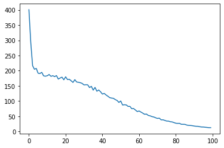

## 確率と言語モデル

### word2vecを確率の観点から眺める
CBOWは以下の式の事後確率をモデル化したもの
- P(wt | wt-1, wt+1) : wt-1とwt+1が与えられたときに、wtが起こる確率

これは、コンテキストを左側のウィンドウだけに固定すると以下のようにもかける
- P(wt | wt-2, wt-1)

その場合の損失関数は
- L = -logP(wt | wt-2, wt-1)

単語の分差表現はあくまで副産物であり、CBOWはコンテキストからターゲットを推測するモデル。

### 言語モデル

言語モデル：単語の並びに対して、それがどれだけ起こりえるか、どれだけ自然な単語の並びであるのかを確率で評価するモデル

ex)
- "you say goodbye : 0.92
- "you say good die : 0.00000032

#### 何に使えるか？
- 機械翻訳、音声認識 -> 生成したいくつかの候補となる文章を、文章として自然であるかどうかという基準でランク付け
- オリジナル文章生成

### CBOWを言語モデルに？
コンテキストを左側のウィンドウに固定すると、前の単語の並びから次の単語を予測する言語モデルになる

問題点
- window_sizeよりも左側にあるコンテキストを考慮することができない。
    - Tow was watching TV in his room. Mary came into the room. Mary said hi to [???]
- window_sizeを大きくしても、コンテキスト内の単語の並びが無視される
    - 中間層で2つの入力が結合されるため。→解決策として、中間層で単語ベクトルを連結することが考えられるが、コンテキストのサイズに比例してパラメータが増える。


→　救世主RNN

## RNNとは

Reccurent : 何度も繰り返し起こること。再発する、周期的に起こる、循環する

### 循環するニューラルネットワーク

- 閉じた経路、ループする経路を持つ
- 時刻t
- ht = tanh(ht-1 * Wh + XtWx + b) : 隠れ状態ベクトル

### Backpropagation Through Time

- ループ展開した後のRNNは、通常のBackpropを行うことができる

- 時間方向に展開したニューラルネットワークの誤差逆伝播方＝Backpropagation Through Time (BPTT)

問題点
- 長い時系列データでは、計算コストが非常に大きくなる＋使用メモリ量も増加する（各時刻のRNNレイヤの中間データをメモリに保持しておく必要あるため）　
- 長い時系列データでは、逆伝播時の勾配が不安定になる

### Truncated BPTT
- ネットワークのつながりを適当な長さで断ち切り、小さなネットワークを複数作る
- 切り取ったネットワークに対してBackpropを行う

★断つのは逆伝播のつながりだけ。順伝播の流れは途切れない

### Truncated BPTTのミニバッチ学習

データの与え方に要注意
- データをシーケンシャルに与えること
- 各バッチでデータを与える開始位置をずらすこと

## RNNの実装

RNNの順伝播
- ht = tanh(th-1 * Wh + Xt * Wx + b)


```python
class RNN:
    def __init__(self, Wx, Wh, b):
        self.params = [Wx, Wh, b]
        self.grads = [np.zeros_like(Wx), np.zeros_like(Wh), np.zeros_like(b)]
        self.cache = None
    
    def forward(self, x, h_prev):
        Wx, Wh, b = self.params
        t = np.dot(h_prev, Wh) + np.dot(x, Wx) + b
        h_next = np.tanh(t)
        
        self.cache = (x, h_prev, Wh)
        return h_next
    
    def backward(self, dh_next):
        Wx, Wh, b = self.params
        x, h_prev, h_next = self.cache
        
        dt = dh_next * (1 - h_next ** 2)
        db = np.sum(dt, axis = 0)
        dWh = np.dot(h_prev.T, dt)
        dh_prev = np.dot(dt, Wh.T)
        dWx = np.dot(x.T, dt)
        dx = np.dot(dt, Wx.T)
        
        self.grads[0][...] = dWx
        self.grads[1][...] = dWh
        self.grads[2][...] = db
        
        return dx, dh_prev
```

### Time RNNレイヤの実装
T個のRNNレイヤを連結したネットワーク


```python
class TRNN:
    def __init__(self, Wx, Wh, b, stateful=False):
        self.params = [Wx, Wh, b]
        self.grads = [np.zeros_like(Wx), np.zeros_like(Wh), np.zeros_like(b)]
        self.layers = None
        
        self.h, self.dh = None, None
        self.stateful = stateful #隠れ状態を維持するか
    
    def set_state(self, h): #TRNNレイヤの隠れ状態を設定
        self.h = j
    
    def reset_state(self): #隠れ状態をリセット
        self.h = None
    
    def forward(self, xs):
        Wx, Wh, b = self.params
        N, T. D = xs.shape
        D, H = Wx.shape
        
        self.layers = []
        hs = np.empty((N, T, H), dtype="f")
        
        if not self.stateful or self.h is None:
            self.h = layer.forward(xs[:, t, :]. self.h)
            hs[:, t, :] = self.h
            self.layers.append(layer)
        
        return hs
    
    def backward(self, dhs):
        Wx, Wh, b = self.params
        N, T, H = dhs.shape
        D, H = Wx.shape
        
        dxs = np.empty((N,T,D), dtype="f")
        df = 0
        grads = [0,0,0]
        
        for t in reversed(range(T)):
            layer = self.layers[t]
            dx, dh = layer.backward(dhs[:, t, :] + dh)
            dxs[:, t, :] = dx
            
            for i, grad in enumerate(layer.grads):
                grads[i] += grad
        
        for i, grad in enumerate(grads):
            self.grads[i][...] = grads
        self.dh = dh
        
        return dxs
        
```

- stateful=True : 隠れ状態を維持する＝どんなに長い時系列データでも、順伝播を断ち切ることなく維持する
- stateful=False : Time RNNレイヤのforward()が呼ばれるたびに、最初のRNNレイヤの隠れ状態を0行列で初期化


## 時系列データを扱うレイヤの実装

- RNNによる言語モデルをRNNLMとする
- Embedding -> RNN -> Affine -> Softmax

### RNNMLの実装


```python
import sys
sys.path.append("..")
import numpy as np
from common.time_layers import *
```


```python
class SimpleRnnlm:
    def __init__(self, vocab_size, wordvec_size, hidden_size):
        V, D, H = vocab_size, wordvec_size, hidden_size
        rn = np.random.randn
        
        #重みの初期化
        embed_W = (rn(V, D) / 100).astype("f")
        rnn_Wx = (rb(D, H) / np.sqrt(D)).astype("f") #Xavierの初期値
        rnn_Wh = (rn(H, H) / np.sqrt(H)).astype("f") #Xavierの初期値
        rnn_b = np.zeros(H).astype("f")
        affine_W = (rn(H, V) / np.sqrt(H)).astype("f")
        affine_b = np.zeros(V).astype("f")
        
        #レイヤの作成
        self.layers = [TimeEmbedding(embed_W),
                      TimeRNN(rnn_Wx, rnn_Wh, rnn_b, stateful=True),
                      TimeAffine(affine_W, affine_b)]
        self.loss_layer = TimeSoftmaxWithLoss()
        self.rnn_layer = self.layers[1]
        
        #すべての重みと勾配をリストにまとめる
        self.params, self.grads = [], []
        for layer in self.layers:
            self.params += layer.params
            self.grads += layer.grads
    
    def forward(self, xs, ts):
        for layer in self.layers:
            xs = layer.forward(xs)
        loss = self.loss_layer.forward(xs, ts)
        return loss
    
    def backward(self, dout=1):
        dout = self.loss_layer.backward(dout)
        for layer in reversed(self.layers):
            dout = layer.backward(dout)
        return dout
    
    def reset_state(self):
        self.rnn_layer.reset_state()
```

### 言語モデルの評価
perplexityという指標がよく用いられる
- 確率の逆数
- 小さければ小さいほど良い
- 直感的には、perplexityの値は分岐数、候補数といった意味合い

ex ) "you say goodbye and I say hello."
- 入力"you"に対して確率分布を出力
- say:0.8 -> perplexity= 1/(0.8) = 1.25 (=次に出現する候補が1個程度に絞り込めた)
- say:0.2 -> perplexity= 1/(0.2) = 5 （=次に出現する候補がまだ5個もある）

### RNNLMの学習コード


```python
import matplotlib.pyplot as plt
from common.optimizer import SGD
from dataset import ptb
from ch05.simple_rnnlm import SimpleRnnlm
```


```python
#ハイパーパラメータの設定
batch_size = 10
wordvec_size = 100
hidden_size = 100 #RNNの隠れ状態ベクトルの要素数
time_size = 5 #Truncated BPTTの展開する時間サイズ
lr = 0.1
max_epoch = 100

#学習データの読み込み（データセットを小さくする）
corpus, word_to_id, id_to_word = ptb.load_data("train")
corpus_size = 1000
corpus = corpus[:corpus_size]
vocab_size = int(max(corpus) + 1)

xs = corpus[:-1] #入力
ts = corpus[1:] #出力（教師ラベル）
data_size = len(xs)
print("corpus_size: %d, vocablary size; %d" % (corpus_size, vocab_size))
```

    corpus_size: 1000, vocablary size; 418
    


```python
#学習時に使用する変数
max_iters = data_size // (batch_size * time_size)
time_idx = 0
total_loss = 0
loss_count = 0
ppl_list = []
```


```python
#モデルの作成
model = SimpleRnnlm(vocab_size, wordvec_size, hidden_size)
optimizer = SGD(lr)

#ミニバッチの各サンプルの読み込み開始位置を計算
jump = (corpus_size -1) // batch_size
offsets = [i * jump for i in range(batch_size)]

for epoch in range(max_epoch):
    for iter in range(max_iters):
        #ミニバッチの取得
        batch_x = np.empty((batch_size, time_size), dtype="i")
        batch_t = np.empty((batch_size, time_size), dtype="i")
        time_idx += 1
        
        for t in range(time_size):
            for i, offset in enumerate(offsets):
                batch_x[i, t] = xs[(offset+time_idx) % data_size]
                batch_t[i, t] = ts[(offset+time_idx) % data_size]
            time_idx += 1
    
        #勾配を求め、パラメータを更新
        loss = model.forward(batch_x, batch_t)
        model.backward()
        optimizer.update(model.params, model.grads)
        total_loss += loss
        loss_count += 1
    
    #エポック毎にperplexityの評価
    ppl = np.exp(total_loss / loss_count)
    print("| epoch %d | perplexity %.2f" % (epoch+1, ppl))
    ppl_list.append(float(ppl))
    total_loss, loss_count = 0, 0
```

    | epoch 1 | perplexity 400.73
    | epoch 2 | perplexity 293.01
    | epoch 3 | perplexity 216.59
    | epoch 4 | perplexity 204.75
    | epoch 5 | perplexity 207.58
    | epoch 6 | perplexity 191.65
    | epoch 7 | perplexity 190.86
    | epoch 8 | perplexity 194.65
    | epoch 9 | perplexity 182.94
    | epoch 10 | perplexity 182.01
    | epoch 11 | perplexity 183.46
    | epoch 12 | perplexity 187.48
    | epoch 13 | perplexity 181.50
    | epoch 14 | perplexity 183.64
    | epoch 15 | perplexity 180.56
    | epoch 16 | perplexity 184.02
    | epoch 17 | perplexity 172.37
    | epoch 18 | perplexity 176.04
    | epoch 19 | perplexity 178.77
    | epoch 20 | perplexity 170.09
    | epoch 21 | perplexity 179.89
    | epoch 22 | perplexity 170.88
    | epoch 23 | perplexity 171.86
    | epoch 24 | perplexity 166.84
    | epoch 25 | perplexity 161.41
    | epoch 26 | perplexity 170.56
    | epoch 27 | perplexity 162.84
    | epoch 28 | perplexity 161.98
    | epoch 29 | perplexity 160.49
    | epoch 30 | perplexity 158.19
    | epoch 31 | perplexity 153.10
    | epoch 32 | perplexity 153.79
    | epoch 33 | perplexity 153.60
    | epoch 34 | perplexity 144.59
    | epoch 35 | perplexity 148.56
    | epoch 36 | perplexity 136.15
    | epoch 37 | perplexity 145.08
    | epoch 38 | perplexity 132.44
    | epoch 39 | perplexity 136.52
    | epoch 40 | perplexity 130.81
    | epoch 41 | perplexity 123.10
    | epoch 42 | perplexity 125.34
    | epoch 43 | perplexity 120.23
    | epoch 44 | perplexity 115.98
    | epoch 45 | perplexity 111.44
    | epoch 46 | perplexity 109.89
    | epoch 47 | perplexity 109.20
    | epoch 48 | perplexity 105.08
    | epoch 49 | perplexity 102.15
    | epoch 50 | perplexity 95.64
    | epoch 51 | perplexity 100.37
    | epoch 52 | perplexity 87.15
    | epoch 53 | perplexity 88.10
    | epoch 54 | perplexity 87.47
    | epoch 55 | perplexity 82.56
    | epoch 56 | perplexity 82.62
    | epoch 57 | perplexity 75.05
    | epoch 58 | perplexity 75.65
    | epoch 59 | perplexity 70.59
    | epoch 60 | perplexity 65.66
    | epoch 61 | perplexity 67.40
    | epoch 62 | perplexity 63.98
    | epoch 63 | perplexity 60.38
    | epoch 64 | perplexity 56.56
    | epoch 65 | perplexity 57.40
    | epoch 66 | perplexity 52.88
    | epoch 67 | perplexity 51.50
    | epoch 68 | perplexity 49.06
    | epoch 69 | perplexity 47.72
    | epoch 70 | perplexity 45.14
    | epoch 71 | perplexity 42.96
    | epoch 72 | perplexity 43.94
    | epoch 73 | perplexity 38.39
    | epoch 74 | perplexity 38.56
    | epoch 75 | perplexity 36.46
    | epoch 76 | perplexity 34.39
    | epoch 77 | perplexity 34.22
    | epoch 78 | perplexity 32.10
    | epoch 79 | perplexity 31.44
    | epoch 80 | perplexity 29.32
    | epoch 81 | perplexity 27.13
    | epoch 82 | perplexity 26.78
    | epoch 83 | perplexity 26.88
    | epoch 84 | perplexity 23.74
    | epoch 85 | perplexity 23.70
    | epoch 86 | perplexity 23.41
    | epoch 87 | perplexity 21.10
    | epoch 88 | perplexity 20.15
    | epoch 89 | perplexity 19.84
    | epoch 90 | perplexity 19.18
    | epoch 91 | perplexity 17.88
    | epoch 92 | perplexity 17.17
    | epoch 93 | perplexity 17.04
    | epoch 94 | perplexity 15.75
    | epoch 95 | perplexity 14.92
    | epoch 96 | perplexity 14.77
    | epoch 97 | perplexity 13.98
    | epoch 98 | perplexity 13.38
    | epoch 99 | perplexity 12.64
    | epoch 100 | perplexity 12.67
    


```python
plt.plot(ppl_list)
```


    [<matplotlib.lines.Line2D at 0x26564a6a148>]





```python

```
