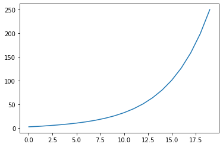
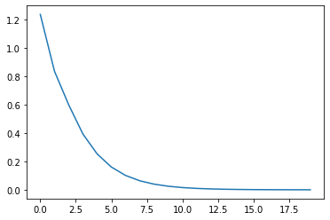
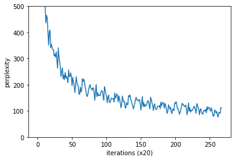

SimpleRNN, Elman
- 長期的な時系列データの依存関係をうまく学習できない

↓

LSTM , GRU　（ゲート付きRNN）

## RNNの問題点
長期的な時系列データの依存関係を学習することが苦手

↑なぜ？

BPTTにおいて、勾配消失/勾配爆発が起こるため。

↑なぜ？

- Backpropでtanh関数を通る度に値が小さくなるため
- BackproでMatmul関数を通るたびに値が大きくなるため


```python
import numpy as np
import matplotlib.pyplot as plt
%matplotlib inline
```


```python
N = 2 #ミニバッチサイズ
H = 3 #隠れ状態ベクトルの次元数
T = 20 #時系列データの長さ

dh = np.ones((N, H))
np.random.seed(3) 
Wh = np.random.randn(H, H)

norm_list = []
for t in range(T):
    dh = np.dot(dh, Wh.T)
    norm = np.sqrt(np.sum(dh**2)) / N
    norm_list.append(norm)
```


```python
plt.plot(norm_list)
```


    [<matplotlib.lines.Line2D at 0x1f463e9fec8>]





```python
N = 2 #ミニバッチサイズ
H = 3 #隠れ状態ベクトルの次元数
T = 20 #時系列データの長さ

dh = np.ones((N, H))
np.random.seed(3) 
#Wh = np.random.randn(H, H) #Before
Wh = np.random.randn(H, H) * 0.5 #fter

norm_list = []
for t in range(T):
    dh = np.dot(dh, Wh.T)
    norm = np.sqrt(np.sum(dh**2)) / N
    norm_list.append(norm)
```


```python
plt.plot(norm_list)
```


    [<matplotlib.lines.Line2D at 0x1f463f7e7c8>]





- このようにMatMulノードを通るたびに、勾配は指数関数的に増大/現象する傾向にある　→　勾配爆発、勾配消失

- 詳しくは論文をあたってね（On the difficulty of training recurrent neural network）

### 勾配爆発への対策

勾配クリッピング
- 重み行列のL2ノルムが閾値を超えたら、重み行列に"閾値/重み行列"の値をかける


```python
import numpy as np
dW1 = np.random.rand(3,3) * 10
dW2 = np.random.rand(3,3) * 10
grads = [dW1, dW2]
max_norm = 5.0

def clip_grads(grads, max_norm):
    total_norm = 0
    for grad in grads:
        total_norm += np.sum(grad ** 2)
    total_norm = np.sqrt(total_norm)
    
    rate = max_norm / (total_norm + 1e-6)
    
    if rate < 1:
        for grad in grads:
            grad *= rate
    
    return grads
```


```python
clip_grads(grads, max_norm)
```


    [array([[0.66651711, 1.09006443, 0.4925201 ],
            [0.4828533 , 1.23252117, 0.20915313],
            [1.15951119, 0.86840351, 1.69684679]]),
     array([[1.79050147, 1.65705945, 1.65247376],
            [0.89579505, 1.60201192, 0.81486791],
            [1.37340937, 0.78120006, 1.067341  ]])]


### 勾配消失とLSTM

- 記憶セルcの追加。これは出力層には影響せず、LSTMレイヤ内だけで完結

- outputゲート：tanh(Ct)の各要素に対して、「それらが次時刻の隠れ状態としてどれだけ重要か」を調整
- forgetゲート：Ct-1（前の記憶セル）から、不要な記憶を忘れる
- tanh : これまで通り、新しい情報を記憶セルに覚えさせる
- inputゲート : 追加する情報の取捨選択。新たに追加する情報にどれだけ価値があるかを判断。 

なぜLSTMでは勾配消失が防げるか？

- 記憶セルは＋演算とアダマール積演算しか通らない。→ここはBackprop時に値がそのまま流れる

### LSTMの実装


```python
class LSTM:
    def __init__(self, Wx, Wh, b):
        self.params = [Wx, Wh, b]
        self.grads = [np.zeros_like(Wx), np.zeros_like(Wh), np.zeros_like(b)]
        self.cache = None
    
    def forward(self, x, h_prev, c_prev):
        Wx, Wh, b = self.params
        N. H = h_prev.shape
        
        A = np.dot(x. Wx) + np.dot(h_prev, Wh) + b
        
        #slice
        f = A[:, :H]
        g = A[:, H:2*H]
        i = A[:, 2*H:3*H]
        o = A[:, 3*H:]
        
        f = sigmoid(f)
        g = np.tanh(g)
        i = sigmoid(i)
        o = sigmoid(o)
        
        c_next = f * c_prev + g * i
        h_next = o * np.tanh(c_next)
        
        self.cache = (x, h_prev, c_prev, i, f, g, o, c_next)
        
        return h_next, c_next
```

### Time LSTMの実装


```python
class TimeLSTM:
    def __init__(self, Wx, Wh, b, stateful=False):
        self.params = [Wx, Wh, b]
        self.grads = [np.zeros_like(Wx), np.zeros_like(Wh), np.zeros_like(b)]
        self.layers = None
        
        self.h, self.c = None, None
        self.dh = None
        self.stateful = stateful 
        
    def forward(self, xs):
        Wx, Wh, b = self.params
        N, T, D = xs.shape
        H = Wh.shape[0]
        
        self.layers = []
        hs = np.empty((N, T, H), dtype="f")
        
        if not self.stateful or self.h is None:
            self.h = np.zeros((N, H), dtype="f")
        if not self.stateful or self.c is None:
            self.c = np.zeros((N, H), dtype="f")
            
        for t in range(T):
            layer = LSTM(*self.params)
            self.h, self.c = layer.forward(xs[:, t, :], self.h, self.c)
            hs[:, t, :] = self.h
            
            self.layers.append(layer)
        
        return hs
    
    def backward(self, dhs):
        Wx, Wh, b = self.params
        N, T, H = dhs.shape
        D = Wx.shape[0]
        
        dxs = np.empty((N, T, D),dtype="f")
        dh, dc = 0, 0
        
        grads = [0, 0, 0]
        
        for t in reversed(range(T)):
            layer = self.layers[t]
            dx, dh, dc = layer.backward(dhs[: ,t, :] + dh, dc)
            dxs[:, t, :] = dx
            for i, grad in enumerate(layer.grads):
                grads[i] += grad
            
            for i, grad in enumerate(grads):
                self.grads[i][...] = grad
            
        self.dh = dh
        return dxs
    
    def set_state(self, h, c=None):
        self.h, self.c = h, c
    
    def reset_state(self):
        self.h, self.c = None, None
        
```

## LSTMを使った言語モデル

- 前章のRNNLMのRNNレイヤをLSTMレイヤに置き換える

PTBデータセットで学習


```python
from common.optimizer import SGD
from common.trainer import RnnlmTrainer
from common.util import eval_perplexity
from dataset import ptb
from ch06.rnnlm import Rnnlm
```


```python
#ハイパーパラメータの設定
batch_size = 20
wordvec_size = 100
hidden_size = 100
time_size = 35
lr = 20.0
max_epoch = 4
max_grad = 0.25
```


```python
#学習データの読み込み
corpus, word_to_id, id_to_word = ptb.load_data("train")
corpus_test, _, _ = ptb.load_data("test")
vocab_size = len(word_to_id)
xs = corpus[:-1]
ts = corpus[1:]
```

    Downloading ptb.test.txt ... 
    Done
    


```python
#モデルの生成
model = Rnnlm(vocab_size, wordvec_size, hidden_size)
optimizer = SGD(lr)
trainer = RnnlmTrainer(model, optimizer)
```


```python
#勾配クリッピングを適用して学習
trainer.fit(xs, ts, max_epoch, batch_size, time_size, max_grad, eval_interval=20)
trainer.plot(ylim=(0, 500))
```

    | epoch 1 |  iter 1 / 1327 | time 0[s] | perplexity 9999.85
    | epoch 1 |  iter 21 / 1327 | time 3[s] | perplexity 3051.40
    | epoch 1 |  iter 41 / 1327 | time 7[s] | perplexity 1225.82
    | epoch 1 |  iter 61 / 1327 | time 10[s] | perplexity 977.26
    | epoch 1 |  iter 81 / 1327 | time 14[s] | perplexity 801.98
    | epoch 1 |  iter 101 / 1327 | time 17[s] | perplexity 655.76
    | epoch 1 |  iter 121 / 1327 | time 21[s] | perplexity 640.42
    | epoch 1 |  iter 141 / 1327 | time 25[s] | perplexity 596.93
    | epoch 1 |  iter 161 / 1327 | time 29[s] | perplexity 577.53
    | epoch 1 |  iter 181 / 1327 | time 33[s] | perplexity 568.57
    | epoch 1 |  iter 201 / 1327 | time 36[s] | perplexity 502.37
    | epoch 1 |  iter 221 / 1327 | time 40[s] | perplexity 496.85
    | epoch 1 |  iter 241 / 1327 | time 43[s] | perplexity 436.16
    | epoch 1 |  iter 261 / 1327 | time 47[s] | perplexity 465.26
    | epoch 1 |  iter 281 / 1327 | time 51[s] | perplexity 454.10
    | epoch 1 |  iter 301 / 1327 | time 55[s] | perplexity 399.48
    | epoch 1 |  iter 321 / 1327 | time 59[s] | perplexity 351.35
    | epoch 1 |  iter 341 / 1327 | time 63[s] | perplexity 403.36
    | epoch 1 |  iter 361 / 1327 | time 66[s] | perplexity 408.46
    | epoch 1 |  iter 381 / 1327 | time 70[s] | perplexity 342.05
    | epoch 1 |  iter 401 / 1327 | time 74[s] | perplexity 354.43
    | epoch 1 |  iter 421 / 1327 | time 78[s] | perplexity 343.18
    | epoch 1 |  iter 441 / 1327 | time 81[s] | perplexity 333.77
    | epoch 1 |  iter 461 / 1327 | time 85[s] | perplexity 334.18
    | epoch 1 |  iter 481 / 1327 | time 89[s] | perplexity 310.13
    | epoch 1 |  iter 501 / 1327 | time 93[s] | perplexity 316.94
    | epoch 1 |  iter 521 / 1327 | time 98[s] | perplexity 305.46
    | epoch 1 |  iter 541 / 1327 | time 102[s] | perplexity 326.37
    | epoch 1 |  iter 561 / 1327 | time 106[s] | perplexity 289.78
    | epoch 1 |  iter 581 / 1327 | time 111[s] | perplexity 262.26
    | epoch 1 |  iter 601 / 1327 | time 115[s] | perplexity 341.39
    | epoch 1 |  iter 621 / 1327 | time 120[s] | perplexity 307.23
    | epoch 1 |  iter 641 / 1327 | time 124[s] | perplexity 287.57
    | epoch 1 |  iter 661 / 1327 | time 128[s] | perplexity 267.56
    | epoch 1 |  iter 681 / 1327 | time 132[s] | perplexity 230.66
    | epoch 1 |  iter 701 / 1327 | time 137[s] | perplexity 251.68
    | epoch 1 |  iter 721 / 1327 | time 142[s] | perplexity 263.80
    | epoch 1 |  iter 741 / 1327 | time 146[s] | perplexity 221.79
    | epoch 1 |  iter 761 / 1327 | time 151[s] | perplexity 237.69
    | epoch 1 |  iter 781 / 1327 | time 156[s] | perplexity 219.76
    | epoch 1 |  iter 801 / 1327 | time 161[s] | perplexity 246.84
    | epoch 1 |  iter 821 / 1327 | time 165[s] | perplexity 225.50
    | epoch 1 |  iter 841 / 1327 | time 170[s] | perplexity 232.64
    | epoch 1 |  iter 861 / 1327 | time 174[s] | perplexity 222.69
    | epoch 1 |  iter 881 / 1327 | time 178[s] | perplexity 208.08
    | epoch 1 |  iter 901 / 1327 | time 183[s] | perplexity 257.10
    | epoch 1 |  iter 921 / 1327 | time 187[s] | perplexity 230.61
    | epoch 1 |  iter 941 / 1327 | time 192[s] | perplexity 231.18
    | epoch 1 |  iter 961 / 1327 | time 196[s] | perplexity 245.38
    | epoch 1 |  iter 981 / 1327 | time 201[s] | perplexity 233.12
    | epoch 1 |  iter 1001 / 1327 | time 205[s] | perplexity 196.11
    | epoch 1 |  iter 1021 / 1327 | time 210[s] | perplexity 228.13
    | epoch 1 |  iter 1041 / 1327 | time 214[s] | perplexity 208.76
    | epoch 1 |  iter 1061 / 1327 | time 219[s] | perplexity 198.28
    | epoch 1 |  iter 1081 / 1327 | time 224[s] | perplexity 169.98
    | epoch 1 |  iter 1101 / 1327 | time 228[s] | perplexity 193.04
    | epoch 1 |  iter 1121 / 1327 | time 233[s] | perplexity 230.85
    | epoch 1 |  iter 1141 / 1327 | time 237[s] | perplexity 208.25
    | epoch 1 |  iter 1161 / 1327 | time 242[s] | perplexity 201.08
    | epoch 1 |  iter 1181 / 1327 | time 246[s] | perplexity 193.00
    | epoch 1 |  iter 1201 / 1327 | time 251[s] | perplexity 164.75
    | epoch 1 |  iter 1221 / 1327 | time 255[s] | perplexity 162.85
    | epoch 1 |  iter 1241 / 1327 | time 260[s] | perplexity 190.36
    | epoch 1 |  iter 1261 / 1327 | time 264[s] | perplexity 171.77
    | epoch 1 |  iter 1281 / 1327 | time 269[s] | perplexity 179.69
    | epoch 1 |  iter 1301 / 1327 | time 274[s] | perplexity 223.35
    | epoch 1 |  iter 1321 / 1327 | time 278[s] | perplexity 212.20
    | epoch 2 |  iter 1 / 1327 | time 280[s] | perplexity 221.03
    | epoch 2 |  iter 21 / 1327 | time 285[s] | perplexity 208.51
    | epoch 2 |  iter 41 / 1327 | time 290[s] | perplexity 191.36
    | epoch 2 |  iter 61 / 1327 | time 295[s] | perplexity 177.52
    | epoch 2 |  iter 81 / 1327 | time 299[s] | perplexity 160.24
    | epoch 2 |  iter 101 / 1327 | time 304[s] | perplexity 154.82
    | epoch 2 |  iter 121 / 1327 | time 309[s] | perplexity 164.41
    | epoch 2 |  iter 141 / 1327 | time 314[s] | perplexity 181.06
    | epoch 2 |  iter 161 / 1327 | time 319[s] | perplexity 192.15
    | epoch 2 |  iter 181 / 1327 | time 323[s] | perplexity 200.77
    | epoch 2 |  iter 201 / 1327 | time 328[s] | perplexity 186.98
    | epoch 2 |  iter 221 / 1327 | time 333[s] | perplexity 185.97
    | epoch 2 |  iter 241 / 1327 | time 338[s] | perplexity 179.05
    | epoch 2 |  iter 261 / 1327 | time 343[s] | perplexity 186.87
    | epoch 2 |  iter 281 / 1327 | time 348[s] | perplexity 188.42
    | epoch 2 |  iter 301 / 1327 | time 353[s] | perplexity 169.31
    | epoch 2 |  iter 321 / 1327 | time 358[s] | perplexity 140.52
    | epoch 2 |  iter 341 / 1327 | time 362[s] | perplexity 173.64
    | epoch 2 |  iter 361 / 1327 | time 367[s] | perplexity 200.75
    | epoch 2 |  iter 381 / 1327 | time 372[s] | perplexity 154.80
    | epoch 2 |  iter 401 / 1327 | time 377[s] | perplexity 170.00
    | epoch 2 |  iter 421 / 1327 | time 382[s] | perplexity 157.24
    | epoch 2 |  iter 441 / 1327 | time 387[s] | perplexity 162.97
    | epoch 2 |  iter 461 / 1327 | time 391[s] | perplexity 158.56
    | epoch 2 |  iter 481 / 1327 | time 396[s] | perplexity 158.16
    | epoch 2 |  iter 501 / 1327 | time 401[s] | perplexity 171.98
    | epoch 2 |  iter 521 / 1327 | time 406[s] | perplexity 177.26
    | epoch 2 |  iter 541 / 1327 | time 411[s] | perplexity 174.96
    | epoch 2 |  iter 561 / 1327 | time 416[s] | perplexity 156.32
    | epoch 2 |  iter 581 / 1327 | time 421[s] | perplexity 140.19
    | epoch 2 |  iter 601 / 1327 | time 426[s] | perplexity 192.34
    | epoch 2 |  iter 621 / 1327 | time 431[s] | perplexity 182.17
    | epoch 2 |  iter 641 / 1327 | time 436[s] | perplexity 165.06
    | epoch 2 |  iter 661 / 1327 | time 441[s] | perplexity 157.63
    | epoch 2 |  iter 681 / 1327 | time 446[s] | perplexity 130.72
    | epoch 2 |  iter 701 / 1327 | time 451[s] | perplexity 152.37
    | epoch 2 |  iter 721 / 1327 | time 456[s] | perplexity 160.72
    | epoch 2 |  iter 741 / 1327 | time 461[s] | perplexity 135.03
    | epoch 2 |  iter 761 / 1327 | time 466[s] | perplexity 131.32
    | epoch 2 |  iter 781 / 1327 | time 471[s] | perplexity 137.05
    | epoch 2 |  iter 801 / 1327 | time 476[s] | perplexity 149.16
    | epoch 2 |  iter 821 / 1327 | time 481[s] | perplexity 145.97
    | epoch 2 |  iter 841 / 1327 | time 486[s] | perplexity 146.70
    | epoch 2 |  iter 861 / 1327 | time 491[s] | perplexity 146.87
    | epoch 2 |  iter 881 / 1327 | time 496[s] | perplexity 133.11
    | epoch 2 |  iter 901 / 1327 | time 501[s] | perplexity 168.69
    | epoch 2 |  iter 921 / 1327 | time 506[s] | perplexity 148.31
    | epoch 2 |  iter 941 / 1327 | time 511[s] | perplexity 154.82
    | epoch 2 |  iter 961 / 1327 | time 516[s] | perplexity 165.26
    | epoch 2 |  iter 981 / 1327 | time 521[s] | perplexity 156.75
    | epoch 2 |  iter 1001 / 1327 | time 526[s] | perplexity 133.66
    | epoch 2 |  iter 1021 / 1327 | time 531[s] | perplexity 157.27
    | epoch 2 |  iter 1041 / 1327 | time 536[s] | perplexity 145.02
    | epoch 2 |  iter 1061 / 1327 | time 540[s] | perplexity 130.27
    | epoch 2 |  iter 1081 / 1327 | time 545[s] | perplexity 112.10
    | epoch 2 |  iter 1101 / 1327 | time 550[s] | perplexity 123.18
    | epoch 2 |  iter 1121 / 1327 | time 555[s] | perplexity 156.81
    | epoch 2 |  iter 1141 / 1327 | time 560[s] | perplexity 143.00
    | epoch 2 |  iter 1161 / 1327 | time 565[s] | perplexity 134.22
    | epoch 2 |  iter 1181 / 1327 | time 570[s] | perplexity 136.72
    | epoch 2 |  iter 1201 / 1327 | time 575[s] | perplexity 113.98
    | epoch 2 |  iter 1221 / 1327 | time 580[s] | perplexity 110.51
    | epoch 2 |  iter 1241 / 1327 | time 585[s] | perplexity 131.94
    | epoch 2 |  iter 1261 / 1327 | time 590[s] | perplexity 124.76
    | epoch 2 |  iter 1281 / 1327 | time 595[s] | perplexity 123.26
    | epoch 2 |  iter 1301 / 1327 | time 600[s] | perplexity 158.35
    | epoch 2 |  iter 1321 / 1327 | time 605[s] | perplexity 154.13
    | epoch 3 |  iter 1 / 1327 | time 607[s] | perplexity 161.09
    | epoch 3 |  iter 21 / 1327 | time 611[s] | perplexity 146.26
    | epoch 3 |  iter 41 / 1327 | time 616[s] | perplexity 137.23
    | epoch 3 |  iter 61 / 1327 | time 621[s] | perplexity 128.38
    | epoch 3 |  iter 81 / 1327 | time 626[s] | perplexity 119.64
    | epoch 3 |  iter 101 / 1327 | time 631[s] | perplexity 106.98
    | epoch 3 |  iter 121 / 1327 | time 637[s] | perplexity 118.61
    | epoch 3 |  iter 141 / 1327 | time 642[s] | perplexity 127.75
    | epoch 3 |  iter 161 / 1327 | time 648[s] | perplexity 141.98
    | epoch 3 |  iter 181 / 1327 | time 653[s] | perplexity 151.95
    | epoch 3 |  iter 201 / 1327 | time 659[s] | perplexity 142.86
    | epoch 3 |  iter 221 / 1327 | time 665[s] | perplexity 142.58
    | epoch 3 |  iter 241 / 1327 | time 671[s] | perplexity 137.48
    | epoch 3 |  iter 261 / 1327 | time 676[s] | perplexity 141.35
    | epoch 3 |  iter 281 / 1327 | time 681[s] | perplexity 143.18
    | epoch 3 |  iter 301 / 1327 | time 687[s] | perplexity 126.15
    | epoch 3 |  iter 321 / 1327 | time 692[s] | perplexity 102.88
    | epoch 3 |  iter 341 / 1327 | time 697[s] | perplexity 127.09
    | epoch 3 |  iter 361 / 1327 | time 702[s] | perplexity 154.90
    | epoch 3 |  iter 381 / 1327 | time 707[s] | perplexity 116.74
    | epoch 3 |  iter 401 / 1327 | time 714[s] | perplexity 132.13
    | epoch 3 |  iter 421 / 1327 | time 721[s] | perplexity 115.93
    | epoch 3 |  iter 441 / 1327 | time 727[s] | perplexity 124.12
    | epoch 3 |  iter 461 / 1327 | time 733[s] | perplexity 118.49
    | epoch 3 |  iter 481 / 1327 | time 739[s] | perplexity 121.87
    | epoch 3 |  iter 501 / 1327 | time 745[s] | perplexity 130.45
    | epoch 3 |  iter 521 / 1327 | time 750[s] | perplexity 138.99
    | epoch 3 |  iter 541 / 1327 | time 755[s] | perplexity 137.13
    | epoch 3 |  iter 561 / 1327 | time 760[s] | perplexity 119.85
    | epoch 3 |  iter 581 / 1327 | time 765[s] | perplexity 107.46
    | epoch 3 |  iter 601 / 1327 | time 770[s] | perplexity 151.58
    | epoch 3 |  iter 621 / 1327 | time 774[s] | perplexity 143.89
    | epoch 3 |  iter 641 / 1327 | time 780[s] | perplexity 130.55
    | epoch 3 |  iter 661 / 1327 | time 784[s] | perplexity 122.27
    | epoch 3 |  iter 681 / 1327 | time 789[s] | perplexity 101.20
    | epoch 3 |  iter 701 / 1327 | time 794[s] | perplexity 120.18
    | epoch 3 |  iter 721 / 1327 | time 799[s] | perplexity 126.91
    | epoch 3 |  iter 741 / 1327 | time 804[s] | perplexity 109.40
    | epoch 3 |  iter 761 / 1327 | time 809[s] | perplexity 104.70
    | epoch 3 |  iter 781 / 1327 | time 813[s] | perplexity 106.45
    | epoch 3 |  iter 801 / 1327 | time 818[s] | perplexity 116.63
    | epoch 3 |  iter 821 / 1327 | time 823[s] | perplexity 117.72
    | epoch 3 |  iter 841 / 1327 | time 828[s] | perplexity 116.11
    | epoch 3 |  iter 861 / 1327 | time 833[s] | perplexity 121.06
    | epoch 3 |  iter 881 / 1327 | time 838[s] | perplexity 108.09
    | epoch 3 |  iter 901 / 1327 | time 842[s] | perplexity 133.80
    | epoch 3 |  iter 921 / 1327 | time 847[s] | perplexity 118.98
    | epoch 3 |  iter 941 / 1327 | time 852[s] | perplexity 128.55
    | epoch 3 |  iter 961 / 1327 | time 857[s] | perplexity 133.31
    | epoch 3 |  iter 981 / 1327 | time 861[s] | perplexity 124.86
    | epoch 3 |  iter 1001 / 1327 | time 866[s] | perplexity 110.45
    | epoch 3 |  iter 1021 / 1327 | time 871[s] | perplexity 129.35
    | epoch 3 |  iter 1041 / 1327 | time 876[s] | perplexity 119.65
    | epoch 3 |  iter 1061 / 1327 | time 880[s] | perplexity 104.08
    | epoch 3 |  iter 1081 / 1327 | time 885[s] | perplexity 90.23
    | epoch 3 |  iter 1101 / 1327 | time 890[s] | perplexity 97.22
    | epoch 3 |  iter 1121 / 1327 | time 895[s] | perplexity 123.09
    | epoch 3 |  iter 1141 / 1327 | time 900[s] | perplexity 115.38
    | epoch 3 |  iter 1161 / 1327 | time 905[s] | perplexity 106.80
    | epoch 3 |  iter 1181 / 1327 | time 909[s] | perplexity 113.91
    | epoch 3 |  iter 1201 / 1327 | time 914[s] | perplexity 95.91
    | epoch 3 |  iter 1221 / 1327 | time 919[s] | perplexity 89.64
    | epoch 3 |  iter 1241 / 1327 | time 924[s] | perplexity 106.91
    | epoch 3 |  iter 1261 / 1327 | time 929[s] | perplexity 105.52
    | epoch 3 |  iter 1281 / 1327 | time 935[s] | perplexity 101.51
    | epoch 3 |  iter 1301 / 1327 | time 940[s] | perplexity 129.98
    | epoch 3 |  iter 1321 / 1327 | time 945[s] | perplexity 127.30
    | epoch 4 |  iter 1 / 1327 | time 947[s] | perplexity 135.86
    | epoch 4 |  iter 21 / 1327 | time 952[s] | perplexity 124.38
    | epoch 4 |  iter 41 / 1327 | time 957[s] | perplexity 108.37
    | epoch 4 |  iter 61 / 1327 | time 962[s] | perplexity 108.43
    | epoch 4 |  iter 81 / 1327 | time 967[s] | perplexity 97.42
    | epoch 4 |  iter 101 / 1327 | time 972[s] | perplexity 86.57
    | epoch 4 |  iter 121 / 1327 | time 977[s] | perplexity 96.96
    | epoch 4 |  iter 141 / 1327 | time 982[s] | perplexity 105.13
    | epoch 4 |  iter 161 / 1327 | time 986[s] | perplexity 118.70
    | epoch 4 |  iter 181 / 1327 | time 991[s] | perplexity 129.38
    | epoch 4 |  iter 201 / 1327 | time 996[s] | perplexity 122.56
    | epoch 4 |  iter 221 / 1327 | time 1001[s] | perplexity 123.43
    | epoch 4 |  iter 241 / 1327 | time 1006[s] | perplexity 116.50
    | epoch 4 |  iter 261 / 1327 | time 1010[s] | perplexity 116.61
    | epoch 4 |  iter 281 / 1327 | time 1015[s] | perplexity 122.39
    | epoch 4 |  iter 301 / 1327 | time 1020[s] | perplexity 105.41
    | epoch 4 |  iter 321 / 1327 | time 1025[s] | perplexity 84.60
    | epoch 4 |  iter 341 / 1327 | time 1030[s] | perplexity 101.25
    | epoch 4 |  iter 361 / 1327 | time 1034[s] | perplexity 130.27
    | epoch 4 |  iter 381 / 1327 | time 1039[s] | perplexity 99.15
    | epoch 4 |  iter 401 / 1327 | time 1044[s] | perplexity 111.84
    | epoch 4 |  iter 421 / 1327 | time 1049[s] | perplexity 95.06
    | epoch 4 |  iter 441 / 1327 | time 1054[s] | perplexity 103.11
    | epoch 4 |  iter 461 / 1327 | time 1059[s] | perplexity 99.62
    | epoch 4 |  iter 481 / 1327 | time 1064[s] | perplexity 104.38
    | epoch 4 |  iter 501 / 1327 | time 1069[s] | perplexity 109.47
    | epoch 4 |  iter 521 / 1327 | time 1074[s] | perplexity 117.64
    | epoch 4 |  iter 541 / 1327 | time 1079[s] | perplexity 114.28
    | epoch 4 |  iter 561 / 1327 | time 1084[s] | perplexity 103.50
    | epoch 4 |  iter 581 / 1327 | time 1089[s] | perplexity 90.51
    | epoch 4 |  iter 601 / 1327 | time 1094[s] | perplexity 127.72
    | epoch 4 |  iter 621 / 1327 | time 1099[s] | perplexity 122.71
    | epoch 4 |  iter 641 / 1327 | time 1104[s] | perplexity 112.64
    | epoch 4 |  iter 661 / 1327 | time 1109[s] | perplexity 104.59
    | epoch 4 |  iter 681 / 1327 | time 1114[s] | perplexity 84.78
    | epoch 4 |  iter 701 / 1327 | time 1120[s] | perplexity 103.54
    | epoch 4 |  iter 721 / 1327 | time 1125[s] | perplexity 108.34
    | epoch 4 |  iter 741 / 1327 | time 1132[s] | perplexity 95.72
    | epoch 4 |  iter 761 / 1327 | time 1138[s] | perplexity 88.58
    | epoch 4 |  iter 781 / 1327 | time 1143[s] | perplexity 87.97
    | epoch 4 |  iter 801 / 1327 | time 1148[s] | perplexity 99.44
    | epoch 4 |  iter 821 / 1327 | time 1153[s] | perplexity 102.99
    | epoch 4 |  iter 841 / 1327 | time 1158[s] | perplexity 99.04
    | epoch 4 |  iter 861 / 1327 | time 1163[s] | perplexity 105.48
    | epoch 4 |  iter 881 / 1327 | time 1168[s] | perplexity 92.26
    | epoch 4 |  iter 901 / 1327 | time 1173[s] | perplexity 116.08
    | epoch 4 |  iter 921 / 1327 | time 1179[s] | perplexity 103.90
    | epoch 4 |  iter 941 / 1327 | time 1184[s] | perplexity 112.49
    | epoch 4 |  iter 961 / 1327 | time 1190[s] | perplexity 113.72
    | epoch 4 |  iter 981 / 1327 | time 1195[s] | perplexity 107.92
    | epoch 4 |  iter 1001 / 1327 | time 1201[s] | perplexity 98.44
    | epoch 4 |  iter 1021 / 1327 | time 1206[s] | perplexity 111.48
    | epoch 4 |  iter 1041 / 1327 | time 1212[s] | perplexity 104.66
    | epoch 4 |  iter 1061 / 1327 | time 1217[s] | perplexity 89.38
    | epoch 4 |  iter 1081 / 1327 | time 1222[s] | perplexity 79.43
    | epoch 4 |  iter 1101 / 1327 | time 1227[s] | perplexity 80.72
    | epoch 4 |  iter 1121 / 1327 | time 1232[s] | perplexity 103.16
    | epoch 4 |  iter 1141 / 1327 | time 1238[s] | perplexity 100.72
    | epoch 4 |  iter 1161 / 1327 | time 1243[s] | perplexity 91.82
    | epoch 4 |  iter 1181 / 1327 | time 1248[s] | perplexity 98.06
    | epoch 4 |  iter 1201 / 1327 | time 1253[s] | perplexity 84.41
    | epoch 4 |  iter 1221 / 1327 | time 1258[s] | perplexity 76.13
    | epoch 4 |  iter 1241 / 1327 | time 1264[s] | perplexity 92.63
    | epoch 4 |  iter 1261 / 1327 | time 1269[s] | perplexity 94.50
    | epoch 4 |  iter 1281 / 1327 | time 1274[s] | perplexity 90.47
    | epoch 4 |  iter 1301 / 1327 | time 1280[s] | perplexity 112.47
    | epoch 4 |  iter 1321 / 1327 | time 1285[s] | perplexity 111.22
    





```python
#テストデータで評価
model.reset_state()
ppl_test = eval_perplexity(model, corpus_test)
print("test perplexity : ", ppl_test)
```

    evaluating perplexity ...
    234 / 235
    test perplexity :  137.00522702782146
    


```python
#パラメータの保存
model.save_params()
```

## RNNLMのさらなる改善

- LSTMレイヤの多層化
- Dropoutによる過学習の抑制
    - 基本的に時間軸方向ではなく、深さ方向に入れる（フィードフォワード型と同じ要領で。）
    - 変分Dropout：時間軸方向へのDropoutの適用
- 重み共有（weight tying）
    - Embeddingレイヤの重みとAffineレイヤの重みを結びつける


```python
from common.time_layers import *
from common.np import * 
from common.base_model import BaseModel
```


```python
'''
#改善例

self.layers = [
    TimeEmbedding(embed_W),
    TimeDropout(dropout_ratio), <- Dropoutを適用
    TimeLSTM(lstm_Wx1, lstm_Wh1, lstm_b1, stateful=True),
    TimeDropout(dropout_ratio),
    TimeLSTM(lstm_Wx2, lasm_Wh2, lstm_b2, stateful=True), <- LSTM層を追加
    TimeDropout(dropout_ratio),
    TimeAffine(embed_W.T, affine_b) <- 重み共有
]

'''
```


    '\n#改善例\n\nself.layers = [\n    TimeEmbedding(embed_W),\n    TimeDropout(dropout_ratio), <- Dropoutを適用\n    TimeLSTM(lstm_Wx1, lstm_Wh1, lstm_b1, stateful=True),\n    TimeDropout(dropout_ratio),\n    TimeLSTM(lstm_Wx2, lasm_Wh2, lstm_b2, stateful=True), <- LSTM層を追加\n    TimeDropout(dropout_ratio),\n    TimeAffine(embed_W.T, affine_b) <- 重み共有\n]\n\n'


```python

```
